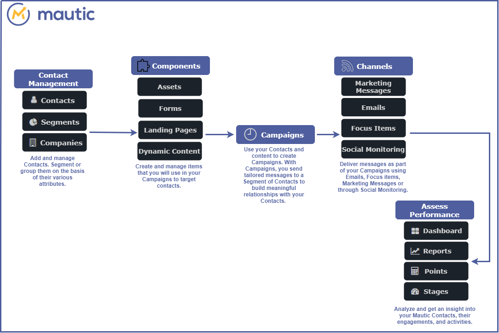

## Overview of Mautic
---

The Mautic platform helps you create a strong marketing strategy for your business. With Mautic, you can:
 - Connect with your contacts over channels like Emails, Text Messages, Social media, and Focus Items.
  - Segment your contacts based on business requirements and personalize your marketing strategy for each segment.
  - Create personalized Campaigns to engage with your contacts.
   - Use performance metrics in Dashboards, Reports, Points, and Stages to measure the efficiency of your marketing strategy.

### How it works  

Let us understand how the different pieces of Mautic fit together to give you a holistic marketing platform experience.

#### Contact Management

Build a rich and functional database of Contacts for your business, group them together based on your business needs or based on shared attributes.

- [Contacts][contacts]: Individuals who have visited your websites or interacted with your business in some way. They may be known or unknown visitors. Contacts are the primary factor of a marketing automation platform.
- [Segments][segments]: A group of your Contacts that share certain attributes. For example, you may segment Contacts based on a contact’s location. This may help you easily send out location-based offers or promotions to this specific group of Contacts.
- [Companies][companies]: A group of Contacts based on the Company(ies) that the Contact is assigned to. 

 **Components**

Create and manage various types of content that you will use for your marketing campaigns to engage your contacts.

- [Assets][assets]: Valubable items that you provide to your contacts upon completion of a form. Whitepapers, a downloadable application/file, documents or vidoes are some examples of assets.
- [Forms][forms]: Forms are the primary point of customer contact. They're used to collect user information, often in exchange for providing access to an asset such as a download, an event registration, or an email newsletter.
- [Landing Pages][landing-pages]: A powerful feature that not only lets you promote content quickly and easily, but also gives you an insight into the kind of content your contacts find interesting.
- [Dynamic Content][dynamic-content]: A feature that you can use to personalize the web experience for your contacts. Marketers can display different content to different people in specific areas of a webpage.

**Campaigns**

With your contact information and the components in place, create customized marketing activities for  your contacts. Such marketing activities are called Campaigns.

**Channels**

Choose one or more channels to deliver the content and messages to your contacts.

- [Marketing Messages][marketing-messages]: A way to personalize  communication with your contacts. With marketing messages, contacts will receive your content on a channel they’ve set as their preference.

- [Emails][emails]: Use built-in email templates to send messages to a bulk of your contacts or send personalized messages to specific contacts.

- [Focus Items][focus-items]: A type of web personalization that enables marketeers to embed a webpage with pop-up messages, a form, or a link based on the contact's behavior. By using Focus Items, you can easily convert visitors into known contacts.

- [Social Monitoring][social-monitoring]: Marketeers can add contacts to Mautic through Twitter mentions and hashtags.

**Assess Performance**

Analyze trends and assess the performance of your marketin strategy using various tools.

- [Dashboard][dashboard]: A high-level representation of user data, Campaigns, and activities. You can create a highly personalized dashboard based on the information that you want to track.

- [Reports][reports]: A tool to measure the effectiveness of your marketing Campaigns, Emails, Forms, or page hits. Reports also let you troubleshoot or workaround areas of improvement to enhance your marketing strategy.

- [Points][points]: A score that is an indicator of progress for a contact or customer. Points are a way for marketers to measure which of their contacts are the most engaged based on their interactions and behavior.

- [Stages][stages]: A customizable feature that enables you to keep a track of where your contacts are in their marketing/sales journey.

<!---links--->

[contacts]: </contacts>
[segments]: </contacts/manage-segments>
[companies]: </companies>
[assets]: </components/assets>
[forms]: </components/forms>
[landing-pages]: </components/landing-pages>
[dynamic-content]: </components/dynamic-web-content>
[campaigns]: </campaigns>
[marketing-messages]: </channels/marketing-messages>
[emails]: </channels/emails>
[focus-items]: </channels/focus-items>
[social-monitoring]: </channels/social-monitoring>
[dashboard]: </dashboard>
[reports]: </reports>
[points]: </points>
[stages]: </stages>
