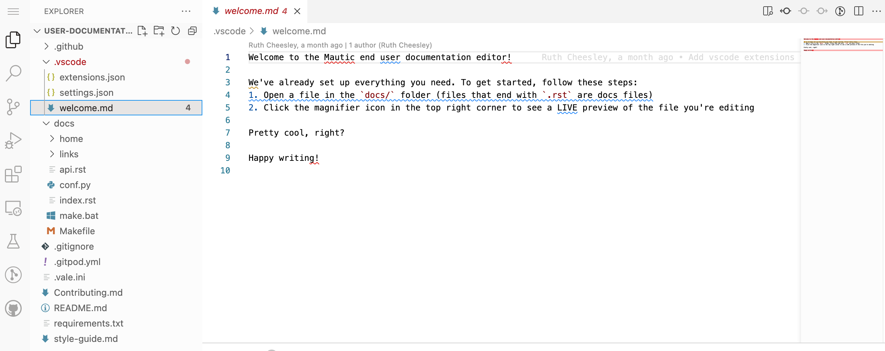
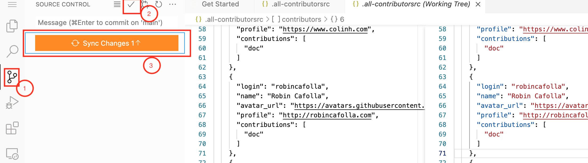

---

We welcome contributions to improve and maintain Mautic documentation.

To contribute to the Mautic user guide, fork the [Mautic user documentation GitHub repository](mautic-docs-github).

To contribute to the Mautic developer documentation, fork the [Mautic developer documentation GitHub repository](developer-docs-github).

These guidelines outline how to contribute to the Mautic documentation hosted on GitHub. Changes to this document can be proposed in a pull request (PR).


<!-- ## Table of Contents -->

<!--
Use this site to generate the TOC list elements:

- https://ecotrust-canada.github.io/markdown-toc/

remove the first two lines
-->

- [Understanding the Repository Structure](#understanding-the-repository-structure)
- [Reading the Style Guide](#reading-the-style-guide)
- [Finding an Issue](#finding-an-issue)
- [Contributing to an Issue](#contributing-to-an-issue)
- [Reporting an Issue](#reporting-an-issue)
- [Creating Pull Requests](#creating-pull-requests)
  * [Using Git on the Command Line](#using-git-on-the-command-line)
  * [Using GitHub Desktop](#using-github-desktop)
    + [Cloning Repository](#cloning-repository)
    + [Creating a Branch](#creating-a-branch)
    + [Commiting Edits](#commiting-edits)
  * [Submitting a Pull Request](#submitting-a-pull-request)
  * [Using Web Browser](#using-web-browser)
  * [Using Gitpod](#using-gitpod)
- [Staying Connected](#staying-connected)

## Understanding the Mautic User Documentation Repository Structure
Mautic documentation is written using [Markdown markup][markup]. The Markdown files are appended with the *.md* extension.

When you fork the Mautic user documentation repository, the repository includes the following files and folders:

- **`README.md`** file introduces and describes the repository, but does not contain any product documentation.
- **`pages`** folder contains folders for each chapter in the Mautic user guide. Each chapter folder contains its own **`docs.en.md`** (one per language - currently, English only) file and the different images used in the *.md* files. For example, within the **Campaigns** folder, you'll find sub-folders for sub-topics such as **Managing Campaigns**, **Campaign Events**, etc..
- **`plugins`** folder contains folders for each plugin that Mautic offers.
- **`themes`** folder contains a folder with supporting files for different themes that Mautic offers.

## Reading the Style Guide

We encourage you to read the [Mautic Style Guide][style guide] for submitting content with a consistent tone, voice, and messaging across the Mautic user documentation. You can find the Mautic Style Guide [here][style guide].

## Finding an Issue

You can familiarize yourself with the Mautic contribution process by reviewing the list of **`good first issues`**, earmarked for new contributors on the [Issues][doc-issues] section. These issues have a relatively limited scope. 

​​After you have selected an issue on the [Mautic Documentation Issues][doc-issues] page, follow the below steps:
 1. Add a comment indicating that you would like to own the ticket. This is to avoid conflicts with others also working on the issue.
 1. After a Mautic administrator assigns you the issue, you can modify files and track changes on GitHub using command line utility, your web browser, GitHub Desktop, or Gitpod.
<br>For more information on how to contribute using GitHub, refer to the [Contributing Changes](#contributing-changes) section. 
 1. Submit a pull request, and share it with a Mautic administrator to review your changes.

## Reporting an Issue
For reporting an issue or proposing a change, follow these steps:
1. Create a new GitHub issue associated with the relevant repository and propose your change there. Be sure to include implementation details and the rationale for the proposed change.
2. The submitted issue will automatically have the 🚦 status: awaiting triage label applied. Wait for a Mautic administrator to evaluate your issue.
1. If the Mautic administator approves the issue and removes the 🚦 status: awaiting triage label, you may start working on the task as described above in the "Contributing to an Issue" section.

## Contributing Changes

This section explains how you can create pull request to submit changes and collaborate using Git, web browser, GitHub Desktop, or Gitpod.

### Using Git on the Command Line

Using Git, you can clone the Mautic user documentation repository on your machine, and edit the documents locally. Changes are proposed in a branch, which ensures that the default branch only contains finished and approved work. The changes can then be commited for tracking, and submitted as a PR link with Mautic reviewers. 

Git requires a GitHub user account, a terminal running bash, and a computer with Git installed and configured. If you want to work with Git locally, without using the command line, you can work with the [GitHub Desktop](#using-github-desktop) client.
Alternatively, you can also install GitHub CLI to use GitHub from the command line. For more information, visit [About GitHub CLI](https://docs.github.com/en/github-cli/github-cli/about-github-cli) page.

To edit documents using Git:

1. Launch the command-line tool on your machine.
1. Change the working directory in the terminal to the location where the documentation repository will reside using the ```cd ``` command.
1. Clone the Mautic user documentation repository.
   ```
   git clone https://github.com/mautic/mautic-documentation.git --origin upstream
   ```
1. Create a new branch to manage your edits, and name it descriptivly. For example, ```{yourusername}-revision-readme-file```

    ```
    git checkout -b {yourusername}-revision-readme-file upstream/master
    ```
1. After editing the documents, commit your edits to your local repository, and add a commit message. The Git commit command requires a commit message that describes what has changed and why so that collaborators to track, review, and merge the edits.

   ```
      git status --short
      git add <new and modified files>
      git commit --message 'move contributing to new file
    ```

1. Push the current branch to GitHub to synchronize the changes, and set the remote as upstream.

   ```
   git push --set-upstream origin {username}-revision-readme-file
   ```
   You will be prompted to enter your GitHub login credentials.

1. After you’ve pushed your commits, visit your repository on GitHub to view the reflected changes and the commit history.Review the changes at your fork ```-https://github.com/{yourusername}/mautic-documentation.```

1. Submit a pull request for a review of the commited changes. For more information, visit the [Creating a Pull Request](#creating-a-pull-request) section.
   
For more Git command line instructions, view the [Git cheatsheet](https://training.github.com/downloads/github-git-cheat-sheet.pdf). 

### Using GitHub Desktop
Using GitHub Desktop, you can clone the Mautic user documentation repository on your machine, and edit the documents locally. Changes are proposed in a branch, which ensures that the default branch only contains finished and approved work. The changes can then be reviewed in GitHub Desktop and commited for tracking.

#### Cloning Repository
The Mautic repository can be cloned directly from the GitHub Desktop application or from the browser. 

To clone a reporitory from the browser:
1. Navigate to [GitHub][mautic-docs-github] repository, and **Fork** it to add it to your profile repositories.
1. Clone the project from your online GitHub account to have a local copy of the project. Ensure that the development environment setup is exactly as stated in the project’s readme file.

#### Creating a Branch
To create a branch for managing your documentation updates:

1. Launch the GitHub desktop client on your machine.
1. On the GitHub GUI, select **mautic-documentation** as your **Current Repository** displayed in the upper-left corner of the GitHub desktop client.
1. To create a new branch, select **Current Branch** displayed in the upper-middle section of the GitHub GUI. The Branches window expands to display the different branches and pull requests available in the Mautic user documentation.
1. On the **Branches** window, click **New Branch** in the **Branches** section.
1. On the **Create a Branch** window, enter a descriptive **Name** (for example, {your-username}-{issue-that-is-going-to-be-fixed}), and click **Create Branch**.
<br>You can now edit your document locally. 

#### Commiting Edits
After editing your document, you must commit your edits locally to the branch before publishing it for review.

To push your edits to your local branch:

1. In the upper section of the GitHub GUI, select the **Current Repository** tab.<br>The **Current Repository** section lists the changes you have made to your file.
1. In the bottom section of the **Current Repository** tab, enter a brief summary and a message describing the key edits you have made to your document. <br>Refer to repository guidelines.
1. Click **Commit to {branch name}**. The changes are committed to the local branch on your machine.

### Using Web Browser

You’re making changes in a project you don’t have write access to. Submitting a change will write it to a new branch in your fork pragatijain/mautic-documentation, so you can send a pull request.

To contribute content using the GitHub web browser:

1.  Navigate to [GitHub][mautic-docs-github] repository, and **Fork** it to add it to your profile repositories.
2. Select a file, and click the **Edit** icon in the upper-right corner of the page to edit the document.
1. After scrolling down the Propose Change section of the page, add descriptive text explaining what you have changed and why.
1. Click **Propose Changes**.
1. On the Comparing Changes page, review and edit the branch for commiting the changes. If desired, create a new branch to manage your contributions.
   >Note: If you are updating more than one file, then you can select the newly created branch to switch to the branch, and then repeat this process until you have made all the required edits, before creating a pull request.
1. Click **Create pull request**.
1. On the Open a pull request page:
    - Enter details about the changes you have made to the document.
    - Reference any [Issues][doc-issues] that the current pull request (PR) resolves so that they are automatically linked. For example, if the PR closes an existing issue #0001, reference it in the description as 'closes #0001'.
    - @mentions of the Mautic administrator for reviewing the proposed changes.
1. Click **Create pull request**.
1. Share the pull request (PR) link at https://github.com/mautic/user-documentation.

### Using Gitpod
To launch your local Mautic workspace in your browser using Gitpod:

1. Navigate to Mautic's documentation repository on GitHub in your browser. 
1. In the browser’s address bar, prefix the entire URL with gitpod.io/# (For example, https://mautic-userdocumentati-gzaubqw95cb.ws-us30.gitpod.io/), and press **Enter**.
1. Within the Mautic ephemeral developer environment, **'welcome.md'** displays suggesting the next steps.

   
1. Edit your documents.
1. To commit your changes, click on the ** source control** icon in the navigation side bar.
1. On the Source Control page, click on the **checkmark icon** in the header to commit the changes.
1. Enter a brief description to explain your commits.

   
1. Click **Sync Changes** to push and pull commits from the main origin.

### Creating a Pull Request
The commited changes can be submitted for review by creating a pull request.

To create a pull request:

1. Navigate to your GitHub account (for example, https://github.com/{username}/) on the portal.
1. Click on your profile in the upper-right corner to select **Your repositories > mautic-documentation**. <br> A notification detailing your push to your branch with a button labeled **Compare & pull request** is displayed at the top of the Comparing changes page.
1. Click **Compare & pull request**.
1. On the Open a pull request page:
    - Enter details about the changes you have made to the document.
    - Reference any [Issues][doc-issues] that the current pull request (PR) resolves so that they are automatically linked. For example, if the PR closes an existing issue #0001, reference it in the description as 'closes #0001'.
    - @mentions of the Mautic administrator for reviewing the proposed changes.
1. Click **Create pull request** to generate the PR link.
1. Share the pull request (PR) link at https://github.com/mautic/user-documentation.

## Looking for Help
 You can [join our Slack network](https://www.mautic.org/slack) if you aren’t already a member. Mautic documentation conversations are organized in the #teducation and #doc channels.


