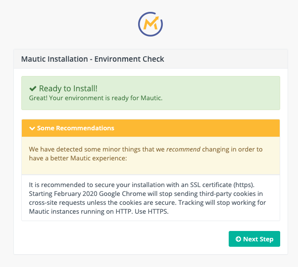
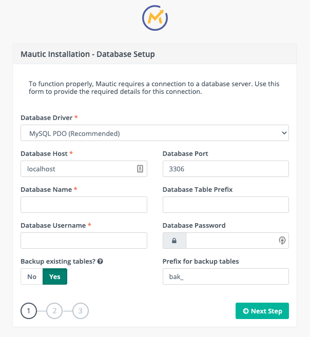
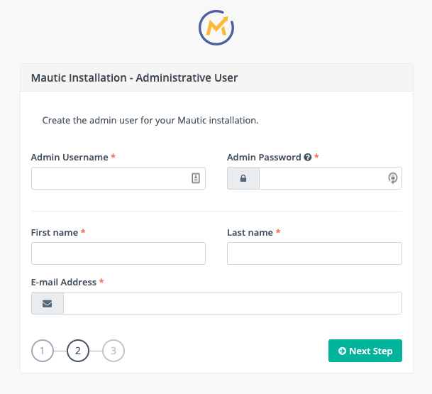
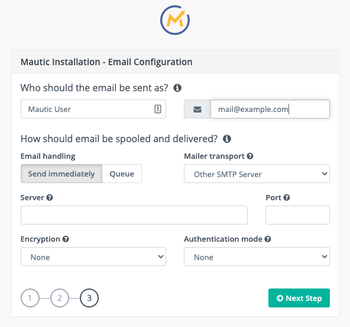

---
title: 'Using the production package'
taxonomy:
category:
- docs
slug: install-mautic-from-package
twitterenable: true
twittercardoptions: summary
articleenabled: false
orgaenabled: false
orga:
ratingValue: 2.5
orgaratingenabled: false
personenabled: false
facebookenable: true
googledesc: 'How to install Mautic from the production package downloaded from mautic.org/download.'
twitterdescription: 'How to install Mautic from the production package downloaded from mautic.org/download.'
facebookdesc: 'How to install Mautic from the production package downloaded from mautic.org/download.'
--- 
## Installing a production package

The Mautic production package can be installed either by uploading the zipped installation package into the server location or using command line installations. The Mautic production package also requires access to a database server.

The Mautic installation is a three-step process:
1. Integrate the database server with the Mautic server.
1. Create an admininstrator account to access the Mautic server.
1. Set up the email server for email marketing automation.

### Preparing for installation

Before installing a package, ensure that:
* Your server environment meets the [minimum requirements][minimum-requirements] for the version you are installing. 
* Your server directory is writable by the Mautic web server.
* Your database meets the [minimum requirements][minimum-requirements] for the supported databases and valid user permissions to access to the database. 
* Your server has enough free disk space to run the installation. Consider the database size as well.
* PHP's `max_execution_time` is at least 240 seconds.

## Downloading a production package

Download the latest stable release as a zip file from [mautic.org/download][download-mautic]. 

For more information about the available Mautic packages, visit [the Mautic Releases][mautic-releases] page.

## Uploading the production package

After downloading a desired package, upload the package zip file to your web server, and unzip it in the directory where the Mautic instance will be hosted.

Your web server must have the permissions to access the unzipped files. For more information on file and folder permissions, visit [this page][file-permissions].

### Using the web-based installer

To access the Mautic server from your browser, enter the URL that corresponds to the Mautic instance (for example, `https://m.example.com`) in your web browser. It is recommended to secure your installation with an SSL certificate (https).

## Conducting Environment checks

After loading the package in the server, the Mautic installer checks if it can run successfully in your server environment. 

Installation errors, displayed in red, must be resolved for completing the Mautic package installation successfully. Warnings, displayed in orange, are often recommendations for a better Mautic experience.



If the environment check is successful (green), click **Next Step** to begin the installation process.

## Integrating the Database

Mautic assumes that the database is on the same server as Mautic.  

For setting the database server on the **Mautic Installation-Database Setup** window:
* Select **Database Driver**.
* Enter **Database Host**.
* Enter **Database Name**.
* Enter **Database Username**.
* If desired, you can also enter values for **Database Port**, **Database Table Prefix**, **Database Password**, and **Prefix for backup tables**.
* By default, **Backup existing tables?** is turned on, but you must turn it off for a new installation.



Click **Next Step**.

## Creating the administrator user account

To create an administrator account for your Mautic instance, enter values for the different fields on the **Mautic Installation - Administrative User** window. 



Click **Next Step**.

## Configuring email settings

To configure your email settings for your Mautic instance, enter details of your email provider on the **Mautic Installation - Email Configuration** window. You can use a tool such as [Mailhog][mailhog] to configure a local instance for testing. 



For configuring your email sender settings:
* Enter the name and email address of the user whose credentials will be used by default for all outgoing email communications. Verify that the provided email address has been successfully authorized by your email provider.
* **Queue** emails and send them through a cron job (to trigger the queue processing) instead of sending them immediately for for larger instances of email handling.
* Select **Mailer transport**. If your provider isn't listed, select **Other SMTP Server** and provide the SMTP credentials. 
API-based sending is significantly faster than SMTP. Depending on the provider you select, additional fields appear to allow you to enter API keys and select regions.
* Enter **Server** and **Port** for your email provider.
* Select **Encryption** and **Authentication mode** for your email provider.

Click **Next Step** to log into the Mautic server.

## Logging into Mautic

On the Mautic login window, enter your Mautic administrator credentials to log into your Mautic instance. 


Click **login** to continue working on your Mautic instance.

# Installing with command lines

Mautic can also be installed using command lines. You can either pass the settings parameters in the command, or create a local PHP file with your database settings. You can also define properties in this file using the syntax expected by the command-line options. 

Use the command `path/to/php bin/console mautic:install --help` for the list of options and flags available.

```
     --db_driver=DB_DRIVER                    Database driver. [default: "pdo_mysql"]
      --db_host=DB_HOST                        Database host.
      --db_port=DB_PORT                        Database port.
      --db_name=DB_NAME                        Database name.
      --db_user=DB_USER                        Database user.
      --db_password=DB_PASSWORD                Database password.
      --db_table_prefix=DB_TABLE_PREFIX        Database tables prefix.
      --db_backup_tables=DB_BACKUP_TABLES      Backup database tables if they exist; otherwise drop them. [default: true]
      --db_backup_prefix=DB_BACKUP_PREFIX      Database backup tables prefix. [default: "bak_"]
      --admin_firstname=ADMIN_FIRSTNAME        Admin first name.
      --admin_lastname=ADMIN_LASTNAME          Admin last name.
      --admin_username=ADMIN_USERNAME          Admin username.
      --admin_email=ADMIN_EMAIL                Admin email.
      --admin_password=ADMIN_PASSWORD          Admin user.
      --mailer_from_name[=MAILER_FROM_NAME]    From name for email sent from Mautic.
      --mailer_from_email[=MAILER_FROM_EMAIL]  From email sent from Mautic.
      --mailer_transport[=MAILER_TRANSPORT]    Mail transport.
      --mailer_host=MAILER_HOST                SMTP host.
      --mailer_port=MAILER_PORT                SMTP port.
      --mailer_user=MAILER_USER                SMTP username.
      --mailer_password[=MAILER_PASSWORD]      SMTP password.
      --mailer_encryption[=MAILER_ENCRYPTION]  SMTP encryption (null|tls|ssl).
      --mailer_auth_mode[=MAILER_AUTH_MODE]    SMTP auth mode (null|plain|login|cram-md5).
      --mailer_spool_type=MAILER_SPOOL_TYPE    Spool mode (file|memory).
      --mailer_spool_path=MAILER_SPOOL_PATH    Spool path.
```
Use the syntax below within a local .php file:

```php
<?php
// Example local.php to test install (to adapt of course)
$parameters = array(
	// Do not set db_driver and mailer_from_name as they are used to assume Mautic is installed
	'db_host' => 'localhost',
	'db_table_prefix' => null,
	'db_port' => 3306,
	'db_name' => 'mautic',
	'db_user' => 'mautic',
	'db_password' => 'mautic',
	'db_backup_tables' => false,
	'db_backup_prefix' => 'bak_',
	'admin_email' => 'admin@example.com',
	'admin_password' => 'mautic',
	'mailer_transport' => null,
	'mailer_host' => null,
	'mailer_port' => null,
	'mailer_user' => null,
	'mailer_password' => null,
	'mailer_api_key' => null,
	'mailer_encryption' => null,
	'mailer_auth_mode' => null,
);
```

## Installing with a local PHP file 

Run the following command after replacing the path to PHP bin and mautic instance URL. 

`path/to/php bin/console mautic:install https://m.example.com`

If desired, you can also add parameters in the install command:

```
path/to/php bin/console mautic:install https://m.example.com
--mailer_from_name="Example From Name" --mailer_from_email="mautic@localhost"
--mailer_transport="smtp" --mailer_host="localhost" --mailer_port="1025"
--db_driver="pdo_mysql" --db_host="db" --db_port="3306" --db_name="db" --db_user="db" --db_password="db" 
--db_backup_tables="false" --admin_email="admin@mautic.local" --admin_password="mautic"
```
As the installation process begins, it flags up warnings and aborts if there are any critical errors.

```
Mautic Install
==============

Parsing options and arguments...
0 - Checking installation requirements...
Missing optional settings:
  - [0] The <strong>memory_limit</strong> setting in your PHP configuration is lower than the suggested minimum limit of %min_memory_limit%. Mautic can have performance issues with large datasets without sufficient memory.
Ready to Install!
1 - Creating database...
1.1 - Creating schema...
1.2 - Loading fixtures...
2 - Creating admin user...
3 - Email configuration and final steps...

================
Install complete
================
```
[download-mautic]: <https://www.mautic.org/download>
[mautic-releases]: <https://www.mautic.org/mautic-releases>
[minimum-requirements]: <https://www.mautic.org/download/requirements>
[file-permissions]: <troubleshooting/file-ownership-and-permissions>
[mailhog]: <https://github.com/mailhog/MailHog>

You can now login to your Mautic instance with your Mautic admin credentials.