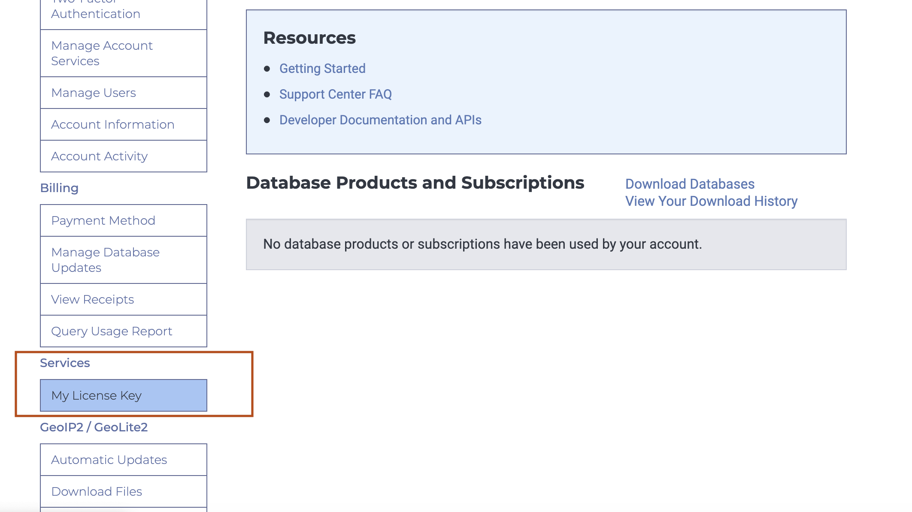
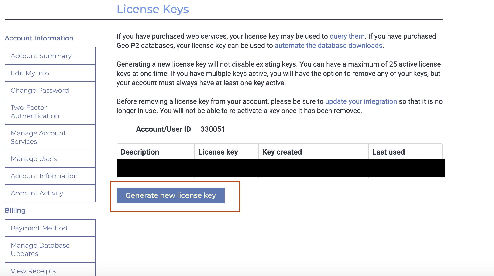
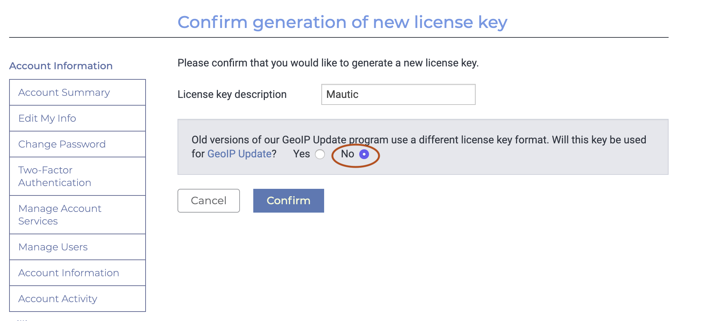
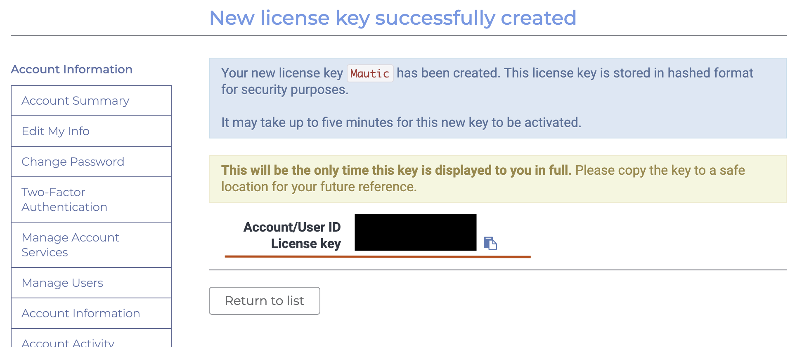
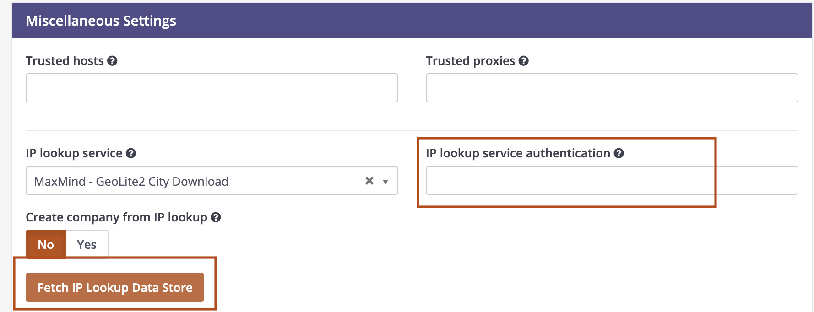

---
From the [2.16 release][216-release], Mautic has supported using a license key to access the MaxMind IP lookup service.

>>>> From the 3.2 release the format for the license key needs to be `AccountID:Licensekey`. You can locate the Account ID directly preceding the license keys table.

Follow these steps to configure your Mautic instance to use the license key.

1. Create a MaxMind account by going to [MaxMind Signup][maxmind-signup]
1. After signing up, verify your email and follow the steps to access your [MaxMind Account][maxmind-account].
1. Click the Contact icon at the top right of the menu to login 

1. After logging in, under services click `My License Key` on the left hand side in the menu

1. Then, Click `Generate new License Key`

1. Answer `Will this key be used for GeoIP Update?` with Yes and confirm

1. Copy the license key that you see on the screen and note down the Account ID preceding the license key table

1. Go to Mautic > Settings > Configuration > System Settings > Miscellaneous Settings and enter the license key into the "IP lookup service authentication" field **in the format `AccountID:Licensekey`**. 

1. Click `Fetch IP Lookup Data Store`. This downloads the IP lookup database to your Mautic instance.
1. Set up the [cron job][cron-jobs] to periodically download a fresh copy.

[216-release]: <https://github.com/mautic/mautic/releases/tag/2.16.0>
[maxmind-account]: <https://www.maxmind.com/en/accounts/>
[maxmind-signup]: <https://www.maxmind.com/en/geolite2/signup>
[cron-jobs]: </setup/cron-jobs#update-maxmind-geolite2-ip-database>
