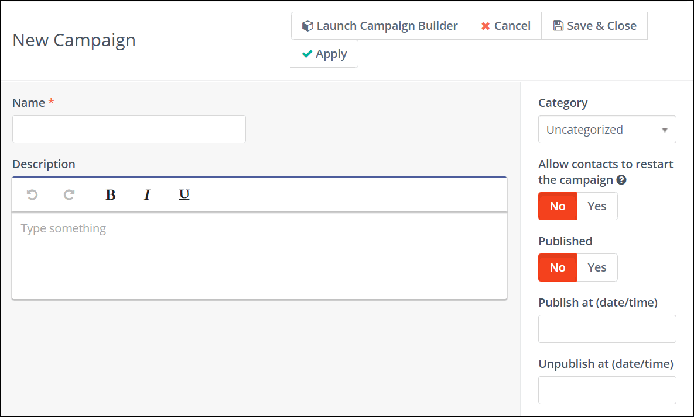

---------------------

# Creating Campaigns

Creating campaigns is a central part of the Marketing Automation process. 

At the heart of any Marketing Automation campaign is the Campaign Builder. This allows you to specify how contacts enter the Campaign, and what happens at every stage after they enter the workflow. 

Once the basics are established, the Campaign Builder handles the finer details of building a campaign workflow using Conditions, Decisions, and Actions.

## Prerequisites

Before you start creating campaigns, you must ensure that you have the following set up:
<!-- What are the prerequisites of campaign creation? Need more information in this section-->
1. Build campaign contacts

    Add or remove contacts in batch for campaigns using the following command:

    ```
    php /path/to/mautic/bin/console mautic:campaigns:update --env=prod
    ```

    See documentation on [cron jobs][cron-jobs] for further details.


2. Create components
3. Set up the channels

## Create your first Campaign

After you create the required components and set up Channels you will be using, you are ready to create your first campaign. 

To begin creating Campaigns, perform the following steps:

1. Launch your Mautic installation.
2. Click **Campaigns** in the left navigation menu. The Campaigns page appears.
3. Click **New** on the Campaigns page. The New Campaign wizard appears  as shown in the following image.

4. Enter a name and a brief description for your campaign.
5. Optionally, you can set the following properties:
 - **Category** - Choose a category to assign your campaign to. Categories help you organize your campaigns. To know more about creating and managing categories, see [Categories][categories].
  - **Allow contacts to restart the campaign** - Click the toggle switch to allow contacts to restart the campaign if you’re building a campaign for a recurring message (birthdays, subscriptions) or transactional operations (activity notifications, updating data). Enabling this option lets contacts go through the same campaign multiple times without you having to clone the campaign.
   - **Published** - Click the toggle switch to publish or unpubish the campaign. Ensure not to publish a campaign until you’re actually ready for it to go live. You can also schedule to publish or unpublish a campaign on  a future date by selecting a time and date.
6. Click **Launch Campaign Builder** to start building your campaign and add at least one event. For information about how to use the campign builder, see [Using the Campaign Builder][using-campaign-builder].

7. After adding events to your campaigns, close the campaign builder and click **Save & Close** to save your campaign.
   

## Executing Campaign Actions

Executing starting actions for contacts newly added to the campaign, scheduled actions, and the actions on the "non-action" decision paths, must be triggered by the system. To do so, create a [cron job][cron-jobs] that executes the following command at the desired interval:

```
php /path/to/mautic/bin/console mautic:campaigns:trigger --env=prod
```

If you want to execute the command at different intervals for specific campaigns, you can pass the `--campaign-id=ID` argument to the command.

[cron-jobs]: </setup/cron-jobs>
[categories]: </categories>
[using-campaign-builder]: </using-campaign-builder>
