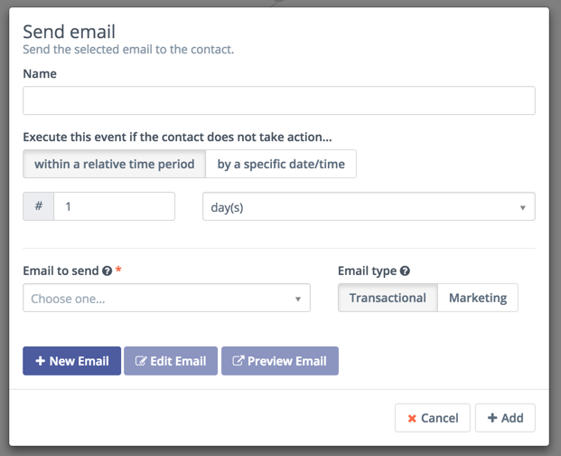

---------------------
## Actions

Campaign actions are events that you initiate on your contacts or contact records. These can represent sending communications to the contact or may automate operational tasks to keep your marketing running. A single Campaign can include more than one action. When you create a Campaign, you select one of these actions to begin the workflow.

The actions that Mautic offers in a Campaign include:

| Action        | Description  | 
| :------------- | :----------: | 
| **Add Do Not Contact**|Adds the user to the Do Not Contact (DNC) list |
| **Add to Company's score** |Adds or subtracts a designated number of Points to or from the score for all Companies associated with the Contact. |
|**Add Company action**| Associates a Contact with a Company and sets the Company as the primary Company for the Contact.|
|**Adjust Contact Points**| Adds or subtracts Points from the Contact’s Point total.|
|**Change Campaigns**| Removes a Contact from the existing Campaign, moves them into another Campaign, restarts the current Campaign or a combination of these. You must remove a Contact from a Campaign before restarting the Campaign.|
|**Change Contact’s Stage**| Moves a Contact to the specified Stage.|
|**Delete Contact**| Permanently deletes the Contact record along with all the information about that Contact, including the Campaign event log record about that Contact. See the [Segment docs][segments]   about how to use this action to delete all contacts in a Segment.|
|**Jump to Event**| Moves Contacts from one point in a Campaign to another without rebuilding events. Use this action to send the Contact to a different path in the Campaign.|
|**Modify Contact’s Segments**| Adds or removes Contacts to/from Segments. If a Contact is removed from a dynamic (filter-based) Segment by a Campaign action, they won’t be re-added to the Segment based on meeting the filter criteria.|
|**Modify Contact’s Tags**| Overwrites or appends Tags on a Contact record. You can add or remove Tags, or do both, in the same action.|
|**Push Contact to integration**| Sends the Contact record to the   selected integration, either creating a new Contact in the chosen integration or updating the connected Contact record.|
|**Remove Do Not Contact**| Removes the user from the   do not contact list.|
|**Send a webhook**| Sends a webhook to a defined URL,  using the GET, POST, PUT, PATCH, or DELETE methods. Headers and data are customizable, and support the use of tokens, such as contact field tokens and contact's IP address as a token. For example, {contactfield=firstname}|
|**Send email**| Sends a Transaction or Marketing email   to the selected contact. A transactional   email can be sent to the contact multiple   times. A marketing email can be sent   to the contact only once across multiple sources. If the contact has already   received this email from another source or   the current campaign, the email will not be   sent again and the contact progresses   through the campaign.|
|**Send email to user**| Sends an email to an entity other   than the contact. This may be a Mautic   user, the contact’s owner, or non-users.  Emails sent using this action does not   generate any statistics for contacts   or emails.|
|**Send marketing message**| Sends a message using the contact's   prefered channel.|
|**Update contact**| Updates the existing contact's fields   with the specified values.|
|**Update contact's primary company**| Updates the existing contact's   primary company fields with the   specified value. See   [Mautic's companies support][companies].|
|**Update contact owner**| Updates the contact's owner.|
|

 

**Notes**:
1.  As the first step of your campaign, you typically send out an email to your contact segments. When you add an email to a campaign, you can select a potential *delay* for when the email is delivered as shown in the following image. If the action is attached to a decision's non-action initiated decision path, the delay becomes how long the contact has to take action before the campaign progresses down the non-action path. 
 

2. The Delete contact action also deletes the campaign event log record about that contact. Therefore, though this action might always display 0% progress on the campaign detail page, it could have deleted some contacts.

   The Delete contact action doesn't allow other campaign events to be connected to it. Since the contact won't exist after this action is triggered, no campaign events are connected to this action.

After adding an action, you can place a decision on the campaign.

[segments]: </contacts/manage-segments>
[companies]: <contacts/companies>
