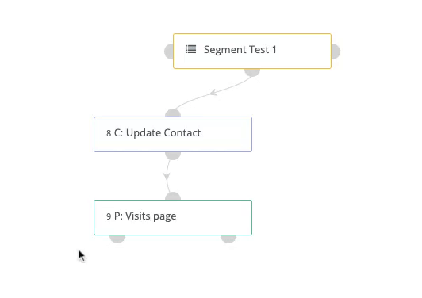

---------------------
## Decisions

Campaign decisions are actions that your Contacts initiate. Downloading an asset, opening an email, or visiting a landing page are examples of decisions. These decisions can be either directly initiated or implied based on non-action. The options for decisions change based on the Campaign actions that you select.

A decision usually has two paths that are denoted by the red and green points on the decision tree. 

 - Green paths  indicate actions that are considered positive or affirmative actions. A contact is sent down this path if the contact **has** taken a direct action such as opening an email or submitting a form. Actions that follow the green paths are executed (or scheduled if a delay is set) at the time the Contact takes the action.
  - Red paths  indicate actions that are considered non-action points. A contact is sent down this path if a contact **has not** taken the action. Use an action's delay settings to define at what point the Campaign should send the Contact to the following steps on this path.

Depending on whether the criteria for the decision is met, the Contact is sent down either the green or the red paths in the decision tree. For example, consider an instance where the decision is to open an email. There can be two outcomes. If the Contact chooses to open the email, then the green decision path connects to the next action to be taken in the Campaign workflow. If, however, the Contact does not open the email, then the red decision path connects to a different action that will be taken (e.g. a delay of 7 days then a second email sent).

Here are the decisions that Mautic offers in the Campaign Builder:

| Decision        | Description  | 
| :------------- | :----------: |
|**Device visit** |Set the options to track whether your Contact visits your page/s from a specific device type, brand, or operating system.
|**Downloads asset**|Set the options to track whether   your contact downloads specified assets.|
|**Request dynamic content**|Set options to push campaign-based   dynamic content if you have a   webpage or landing page where you   want to add dynamic content.|
|**Submits form**|Set options to track whether the   contact has submitted any Mautic   forms. You can also limit this decision   to track specific forms.|
|**Visits a page**|Specify single or multiple pages you want the contact to visit.|
|

 

### Email-Related Decisions

Some decisions in the campaign builder are available for use only if you select the **Send Email** campaign action.

Here are the decisions that are email-related:

| Decision        | Description  | 
| :------------- | :----------: |
|**Opens email**| Tracks whether the contact   opens the email.|
|**Clicks email**|Tracks whether the contact   clicks a link within the send email.|
|**Replies to email**|Tracks if a contact has replied to an  email that you sent.|
|
 

> **Note**:
A contact must already be part of the campaign in order for it to recognize the decision that is executed. Therefore, campaigns should never start with a decision unless you are manually managing the contacts assigned to it and the decision is expected to be executed at a later time.
