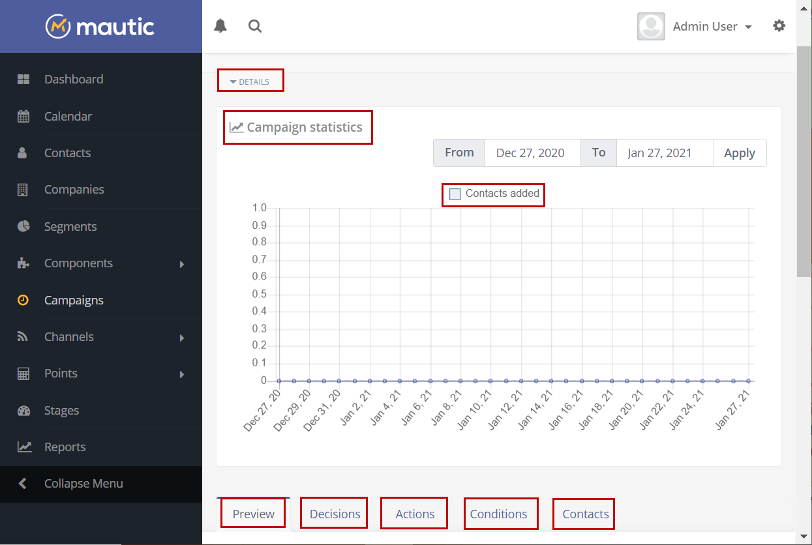

---------------------
# Managing Campaigns

You can manage your Campaigns from the Campaigns overview page.

Click any Campaign name on the Campaigns page to take you to the Campaign overview page. Each page displays details of your Campaign, including the number of Contacts that have been added to the Campaign, the number of Emails sent, the number of page views resulting from the Campaign, and more.

Additional information includes a quick overview of what decisions and actions are available in the Campaign, as well as a grid layout overview of all the Contacts in the Campaign.

The following image shows a sample Campaigns overview page with its highlighted panels:

The **Details** drop-down menu gives a quick overview of the most important information about your campaign. This information inlcudes the name of the user who created the campaign, category of the campaign, creation date and time, publishing date and time, contact segments in your campaign and more.

The **Campaign Statistics** panel shows a graph of the number of contacts added to the campaign over the specified period of time. To specify the time period, use the **From** and **To** date selectors, and click **Apply**.

The **Preview** tab displays a diagrammatic preview of your campaign. 

The **Decisions** tab displays a tabular list of all the decisions that you have added to your campaign.

The **Actions** tab displays a tabular list of all the actions that you have added to your campaign.

The **Conditions** tab displays a tabular list of all he conditions that you have added to your campaign.

The **Contacts** tab displays a grid view of all the contacts that you have added to your campaign. 

The **Recent Activity** panel on the right displays the recent activities that take place in the campaign.
