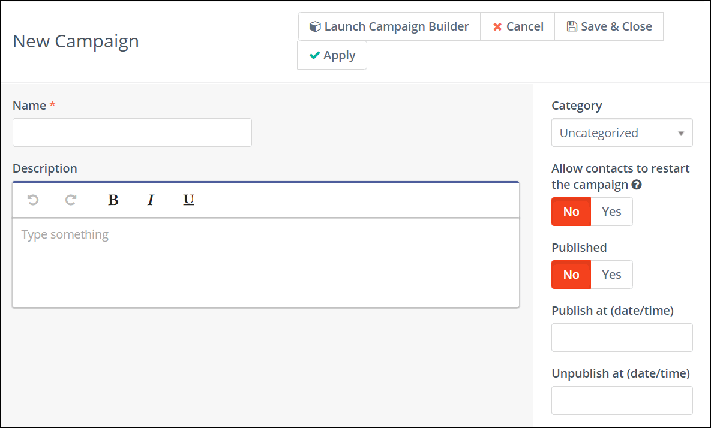

---------------------
Creating Campaigns is a central part of the marketing automation process. When you create a new Campaign, you perform the basic administrative tasks such as choosing a name for the Campaign, creating a description, assigning a Category and defining publishing information for the Campaign. 

At the heart of any marketing automation campaign is the Campaign Builder. This allows you to specify how Contacts enter the Campaign, and what happens at every stage after they enter the workflow. 

Once the basics are established, the Campaign Builder handles the finer details of building a Campaign workflow using Conditions, Decisions, and Actions.

## Prerequisites

Before you start creating Campaigns, you must ensure that you have the following set up:

1. Create a Contact Segment or a Form to initialize your Campaign. If you already have an existing Segment or Form to use, ensure that they're up-to-date.
2. Create any custom field that you need for your Contact profile.
3. Set up and configure any integration that you intend to use in your Campaign.
4. Set up appropriate channels such as Text Messages, Email, Focus items  to communicate with your Contacts.
5. Create Assets, Landing pages, or other Components that you want to use for your Campaign. If using assets, ensure that you upload them before creating your Campaign.

Although you can set up Channels and create Components during the process of creating the Campaign, it is ideal to have them ready beforehand as it makes the Campaign building process faster and more efficient. 

## Create your first Campaign

After you have the prerequsites in place, you are ready to create your first Campaign. 

To begin creating Campaigns, perform the following steps:

1. Launch your Mautic instance.
2. Click **Campaigns** in the left navigation menu. The Campaigns page appears.
3. Click **New** on the Campaigns page. The New Campaign wizard appears as shown in the following image.

4. Enter a name and a brief description for your Campaign.
5. Optionally, you can set the following properties:
 - **Category** - Choose a category to assign your Campaign to. Categories help you organize your Campaigns. To learn more about creating and managing categories, see [Categories][categories].
  - **Allow contacts to restart the Campaign** - Click the toggle switch to allow Contacts to restart the Campaign if you’re building a Campaign for a recurring message (birthdays, subscriptions) or transactional operations (activity notifications, updating data). Enabling this option allows Contacts to go through the same Campaign multiple times.
   - **Published** - Click the toggle switch to publish or unpublish the Campaign. Ensure that you do not publish a Campaign until you’re actually ready for it to go live. You can also schedule to publish or unpublish a Campaign at a future date by selecting a time and date.
6. Click **Launch Campaign Builder** to start building your Campaign, and add at least one event. For information about how to use the Campaign Builder, see [Using the Campaign Builder][using-campaign-builder].

7. After adding events to your Campaign, close the Campaign Builder and click **Save & Close** to save your changes.
   
### Add or remove Contacts in batch 
After creating your Campaign, you can add or remove Contacts in batch for Campaigns using the following command:
```
php /path/to/mautic/bin/console mautic:campaigns:update --env=prod
```
See documentation on [cron jobs][cron-jobs] for further details.


[cron-jobs]: </setup/cron-jobs>
[categories]: </categories>
[using-campaign-builder]: </campaigns/using-campaign-builder>
