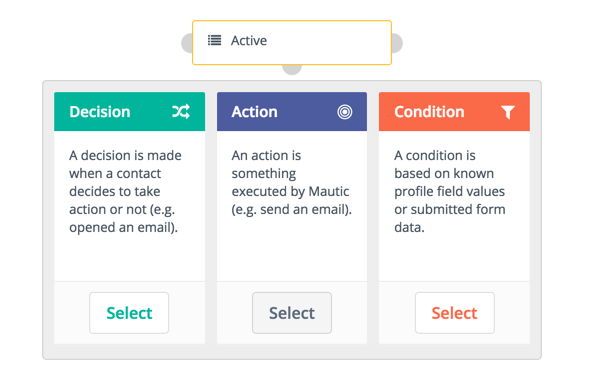

---------------------
The Campaign Builder provides a blank canvas on which you can build your Campaign workflow. A Campaign Builder is made up of conditions, decisions, and actions. It  enables you to create a simple workflow by dragging and dropping various decisions, actions, and conditions onto a canvas.


To build your Campaign, perform the following steps:

1. Click **Launch the Campaign Builder** on the New Campaigns wizard. The Contact Sources menu appears as shown in the following image.


   In this step, you specify the Contacts to be included in your Campaign. Campaigns can be triggered by Contacts joining a Segment, and/or submitting Forms.

2. Select where your campaign will pull the Contacts from: 

 - **Contact Segments**: Choose this option if you want to send your Campaign to a specific group of your Contacts that share certain attributes, for example, 'Located in the USA' or 'Visited Product A page'.
 
    Note that the Segment selection will only show public Segments. If you create a Segment marked as private, that Segment will not be available for use in Campaigns.

 - **Contact Forms**: Choose this option if you want to start the Campaign when the Contact completes a specified Form. Forms are the primary point of gathering information about a Contact. This information can then be used to perform a number of actions in a Campaign. 
 
   You can select a mix of both types of Contact sources for your Campaign. To use both, click the grey selector button on either the left or right side of the **Contact source** box to add whichever source type you didn’t originally select.

3. After selecting one or more Contact sources, click the grey selector button to add at least one event to your Campaign. A Campaign event comprises of a combination of actions, decisions, and/or conditions as shown in the following image:



For more information about Campaign actions, decisions, and conditions, see the following topics:

 - [Actions][actions]
 - [Decisions][decisions]
 - [Conditions][conditions]

## Trigger campaign events

Actions and decisions in a Campaign must be triggered by a [cron job][cron-jobs] which executes the following command at the desired interval:

```
php /path/to/mautic/bin/console mautic:campaigns:trigger --env=prod
```

If you want to execute the command at different intervals for specific Campaigns, you can pass the `--campaign-id=ID` argument to the command.

[actions]: </campaigns/using-campaign-builder/actions>
[decisions]: </campaigns/using-campaign-builder/decisions>
[conditions]: </campaigns/using-campaign-builder/conditions>
[cron-jobs]: </setup/cron-jobs>
