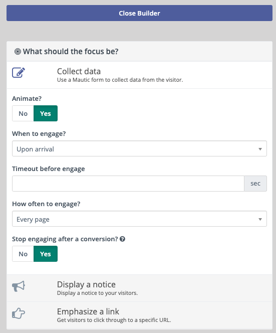
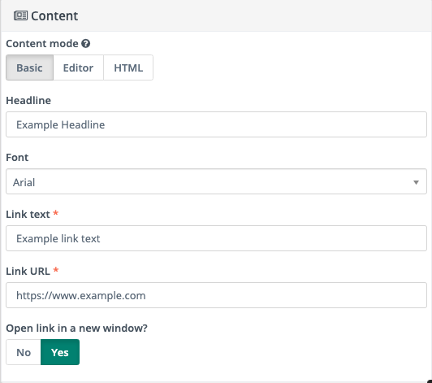
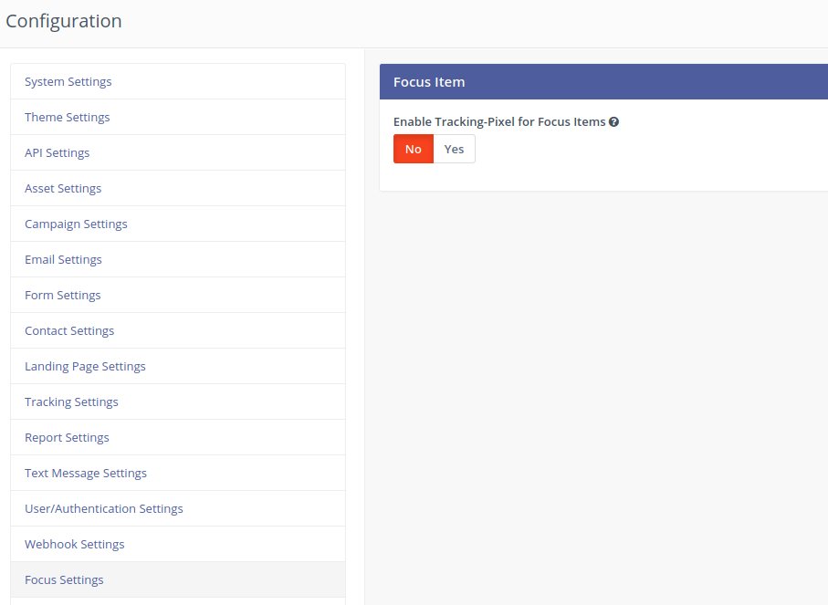

---
Focus items allow you to engage users on your site through bars, modals, notifications and full page takeovers. These can be initiated at different times and with different actions such as exit intent.

Focus Items are listed under the Channels menu.

## Creating a Focus Item

When creating a focus item, you'll see that there is a place to enter a website. 

>>> Some websites will not allow the preview to be displayed. For the preview to work, the site must be secured with an SSL certificate, and it must not block iframe previews with the x-frame-options: SAMEORIGIN header. An error will be displayed in the builder if these conditions are not met.
 

After entering the website, click the builder button top right. This is where the magic happens.

 
On the left, you'll see a button to switch between mobile and desktop views. A mobile snapshot is also attempted - it may not match your website exactly due to the snapshot process but it should at least give you the general look. On the right is the builder toolbar.   

### Focus/Goal

The first step to building the focus item is to choose what the focus or goal is. There are three options:

1. Collect data - will use a Mautic form in the output as the content. Note that it should be a very simple form if using layouts such as the bar (one or or two inputs) as there is very little room to work with in some of the styles. This is great for capturing emails for a newsletter signup.
1. Display a notice - text-based information only - great for announcements and important messages.
1. Emphasize a link - great for landing pages with an event, sale, promotion, and so forth. It displays a button to click, which will direct the visitor to the given link.

Each focus/goal will have slightly different settings but all have a few in common:
  
1. Animate? - Should the focus item be animated or static?
1. When to engage - this determines when the focus item is engaged, based on visitor interaction. It can be shown immediately on arrival, on scrolling slightly; to the middle of the page or to the bottom of the page, or when the visitor appears to be navigating away from the page. If `Visitor intends to leave` is chosen, an option appears that allows the ability to trigger engagement if links within the site have been clicked.
1. Timeout before engage - allows a delay (in seconds) before the focus item is triggered.
1. How often to engage - should the visitor be engaged every time, once per session, or repeatedly at specified intervals of time? 
1. Stop engaging after a conversion - once a user clicks the link or submits the form (not applicable for displaying a notice), enabling this option will no longer engage the visitor.

### Focus Style

There are four styles supported - 

1. Bar - display a bar across the top or bottom of the page
1. Modal - a small modal window that appears centred on the page
1. Notification - these are like modals but smaller and slide in from the side.
1. Full page - also like a modal, only it takes up the entire view.

Each style has its own settings such as position, size, sticky, etc.

#### Colors

By default, Mautic will determine the top colors extracted from the snapshot. Four colors are currently supported for primary color, text color, button color, and button text color.
 
### Content

Again this will vary based on the selected focus/goal and style is chosen. Some support a headline and a tagline while some support only a headline due to space constraints. If the goal is to collect data, a list of forms will be available to choose from. Remember that the form should be simple. 

#### Content mode

It is possible to format content in Basic, Editor or HTML mode. This opens the door for even more creativity when engaging visitors to your site.

>>>> Switching between Basic, Editor and HTML mode will **not** carry over the content between modes.

## Inserting focus items into a website

Inserting a focus item into a website is as simple as copying one line of code and inserting it into your page's source. After creating and saving the focus item, view the details page, where you can see engagement graphs and other detailed information. 

On the right, you'll see a  "Focus Installation" box which includes the line of code needed. Click on it, copy, then paste it into your website's source before the closing body tag if possible.

## Focus Items in Campaigns

Focus Items action depends on page visits. This means that **you must add it just after 'Visits a page' decision**.

## Disabling Tracking

In the Mautic Configuration you can disable to set the Tracking Cookie.

If set to no, there will be no Tracking Cookie set. This allows Focus Items to be used even if a Consent Manager is used and the user has denied consent to tracking, marketing cookies etc. The mautic_focus cookie will still be set (can be defined as "technically required") but nothing else.
