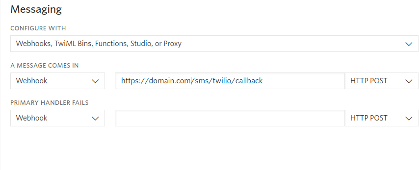

---------------------
This new channel was added in Mautic 1.4.0. It allows Mautic to send text messages from campaigns.

## Create a new Text Message

A Text Message can be created/modified only via Campaign Builder.

Before you start to send text messages from your Mautic instance you need to configure the text messages correctly (see [Twilio Plugin][twilio-plugin]), then follow these steps:

1. Go to *Campaigns*.
1. Edit an existing campaign or create a new one.
1. Open the Campaign Builder.
1. Add a *Send Text Message* action to the canvas.
1. Click the *New Text Message* button. The form in a new browser window will appear.
1. Fill in the *Internal Name*, *Text Message* and if required, change the language. Save it.

The new Text message will be pre-selected so you can save the *Send Text Message* action as well. You can use the action in your Campaign dripflow.

## Segment (Broadcast) Text Messages
These are marketing text messages by default. Segments are assigned to the text message which will determine which contacts receive the communication. Note that each contact can only receive the text message once - it's like a mailing list.

Initiating these text messages requires the Send Scheduled Broadcast Cron Job. See [Cron Jobs][cron-jobs] for more detail.

## Tracking Replies and Unsubscribes

Contacts can unsubscribe from your SMS messages by replying with the word "Stop" to your SMS. Once Mautic receives this SMS, the specific contact will be marked as Do Not Contact (DNC) and will not be contacted again via text message.

You can also get SMS replies in your contact's timeline like this 

## Important Sidenotes 
* +XXXXXXX format for the contact phone number including the + and no space.
* fulfilled in the mobile contact field.
* the configuration tab must contain the phone number with same format: +XXXXXXX
* the SID must be the one of the account, not the one of the phone number
* STOP, STOPALL, UNSUBSCRIBE, CANCEL, END, and QUIT - will stop customers from receiving messages from that particular Twilio number.

## Configure Twilio Webhooks

In order to make Twilio send back replies to Mautic, you have to follow these steps: 

1. Go to your Twilio dashboard -> Phone Numbers -> Manage Numbers -> Active Numbers, then select the number you are sending from (the same number you configured in the steps above), or follow [this link][twilio-active-numbers]

2. Go the messaging section, and configure a webhook as shown in the screenshot below. Make sure that you point back to your server like this `https://example.com/mautic/sms/twilio/callback` where https://example.com/mautic/ is the path to your Mautic instance.

After these configurations, Twilio will notify Mautic of any incoming SMS replies.

[cron-jobs]: </setup/cron-jobs#send-scheduled-broadcasts-e-g-segment-emails>
[twilio-plugin]: </plugins/twilio>
[twilio]: <https://www.twilio.com>
[twilio-paid-accounts]: <https://support.twilio.com/hc/en-us/articles/223183208-Upgrading-to-a-paid-Twilio-Account>
[twilio-international-alphanumeric-id]: <https://support.twilio.com/hc/en-us/articles/223133767-International-support-for-Alphanumeric-Sender-ID>
[twilio-docs-alphanumeric-id]: <https://support.twilio.com/hc/en-us/articles/223181348-Getting-started-with-Alphanumeric-Sender-ID>
[twilio-active-numbers]: <https://www.twilio.com/console/phone-numbers/incoming>