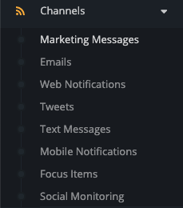
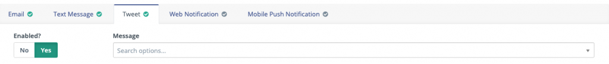

---------------------
## What are Marketing Messages?
The Marketing Messages feature can be found under the Channels section in Mautic, and is one of the channels available to you through which you can optimize and personalize communication with your customers.

Marketing messages allow you to empower the customer to decide how they prefer to receive the content you send via the channel they have set as their preference.

With marketing messages, you can create content and make it available through multiple channels - email, SMS, browser notification, mobile notification, tweets, and any other channel you decide to create using Mautic's extendable open architecture.

When using the 'Send Marketing Message' action in a campaign, the message can be created in any or all of these channels.  If the contact has a channel preference set on their profile, Mautic will send the content on the preferred channel.  If they have not specified a channel, the default channel will be used.

It is also possible for a contact to specify their own frequency rules and pause communication all together on a channel - if these have been reached when a marketing message is scheduled, Mautic will use another channel which has available frequency.

## Creating a new marketing message

To create a new marketing message, navigate to the Channels section and click on Marketing Messages.  Click on +New.

Provide a name and description for the marketing message, then choose the channels you wish to use.  Note that you must set up and configure the channels before they become available - if you have not set up mobile notifications or SMS, you won't see it as an option when creating a marketing message.

To enable a channel, simply click 'yes' on the Enabled slider, and select (or create) the message to use.
