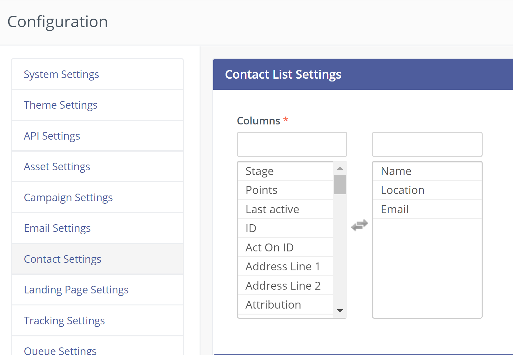
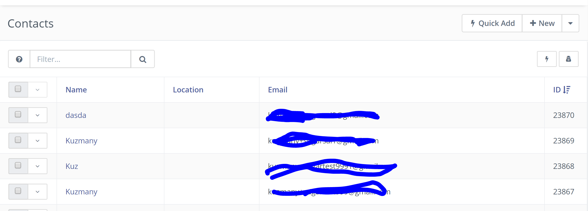

---
You can manage Custom Fields through the _Admin_ menu (click the cogwheel upper right hand side of Mautic).

## Custom Fields

The _Custom Fields_ page will let you view all existing Contact fields as well as any custom Contact Fields you have created.

You will notice the group column which will show you where the specific field will be shown on the _Contact profile_. In the last column, you may see several icons which signify various properties of the field:

1. Lock icon - These fields are unable to be removed as they are used by the core installation.
2. List icon - These fields can be used as filters of segments.
3. Asterisks icon - These fields are required when filling in the contact form
4. Globe icon - These fields are publicly updatable through the [Tracking pixel][variables] URL query (see [Contact Monitoring][contact monitoring] for more details).

### Published Fields

There is a toggle switch which shows before each label title.\
This type of switch is used throughout the Mautic UI to publish and unpublish items.

### Adding A New Field

You can create additional Custom Fields and define the data type you want that field to hold. In addition to the data type you will also select the group for that particular field. This will define where the field displays on the Contact edit and detail view.

### Customize Contact List Column

You can create your custom Contact List column from your configuration and add the fields that you want. To do that you need to: 

1. Go to Configurations > Contact Settings to see the Contact List Settings.

2. Customize your columns by selecting the differet fields according to your needs. You can use the search bar to search for fields.
3. Save and go to Contacts to check if your changes were applied.

[contact monitoring]: </contacts/manage-contacts/contact-monitoring>
[variables]: </setup/variables>
