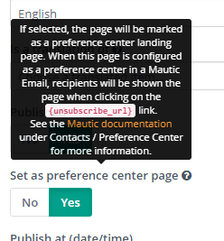
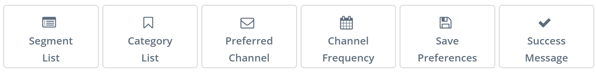
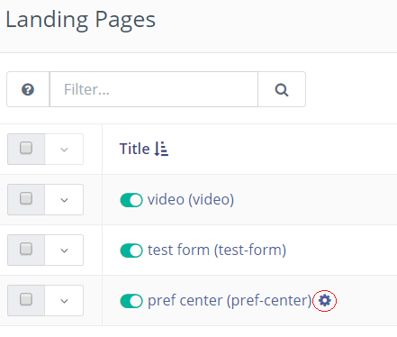
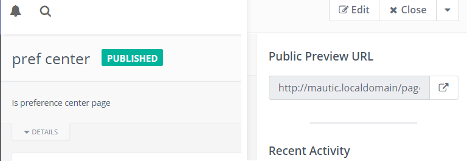
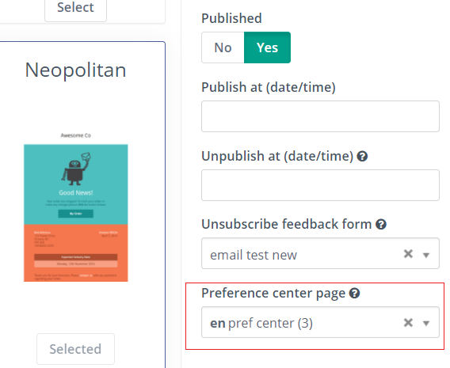
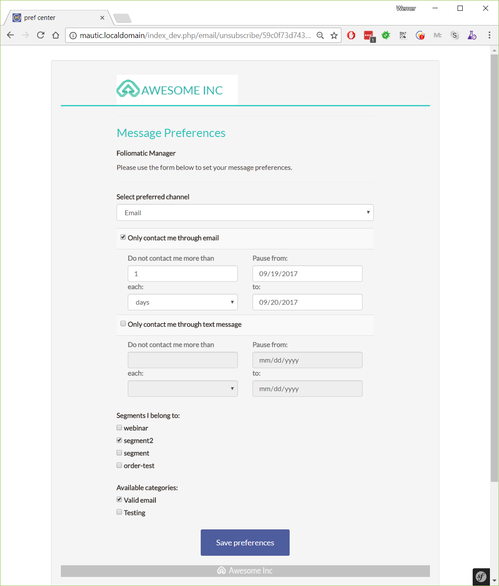
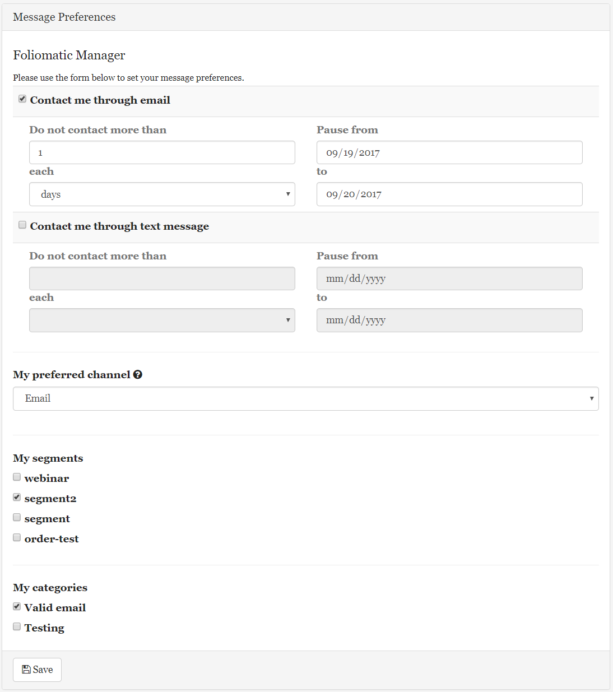

---
It is possible to customize the personal Preference Center/unsubscribe page and edit text labels, format and apply themes using the landing page builder.

## Creating a Preference Center Landing Page

When creating/editing a landing page, there is a toggle switch labeled _Is Preference Center_.  If selected, the page [will be marked](#landing-pages) as a preference center landing page.

> **Note**
>
> When [PR#7915][pr7915] is merged it will be labeled _Set as preference center page_

When this page is [configured as a preference center in a Mautic Email](#setting-preference-center-pages-in-emails), recipients will be shown the page when clicking on the [**`{unsubscribe_url}`**](#tokens) link.  It also shows or hides the [Preference Center slots](#builder-slots) in the builder.

### Builder slots

These slots in the builder are used to customize the page:

### Tokens

Optionally, you can use [tokens][variables] to insert the different slots. Keep in mind that if you use [tokens][variables], you lose the ability to customize the labels and styles of the [slots](#builder-slots) because it uses the default ones.

See the [VARIABLES][variables] page for a full list of tokens.

To finish, don't forget to include a "save preferences" button, otherwise the preferences can't be saved:

Save the page and the Preference Center landing page is ready.

## Landing Pages

Now in the landing pages list, the icon with the little cog indicates that the page is a Preference Center one.

When viewing a Preference Center page, there is a header indicating its purpose and the page URL is not available, only the preview URL.

## Setting Preference Center Pages in Emails

When creating or editing an email, you can select the Preference Center page from the list as shown:

Keep in mind that your mail must use the same langugage as the Preference Center landing page - if not, default Preference Center will be shown.

Now when the email is sent, all recipients will be able to click on the [Unsubscribe link (`{unsubscribe_text}` and `{unsubscribe_url}`)][variables] and the new Preference Center page will be displayed.

If no Preference Center page is selected in an email, the default page is displayed.

[variables]: <./../setup/VARIABLES.html>

[pr7915]: <https://github.com/mautic/mautic/pull/7915>
