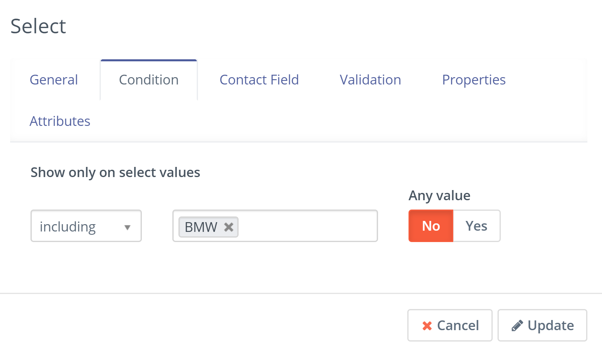
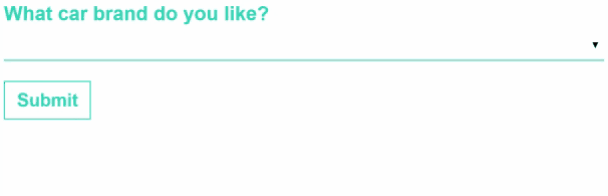

---------------------

## Conditional Fields

Since Mautic [4.1][mautic-4.1] it has been possible to create fields in Mautic Forms which will be displayed based on selected values. This is sometimes referred to as conditional or dependent fields.

When using a select box in a Form, it is possible to attach other fields based on what is selected in the parent field. This feature also supports multiselect fields.

To configure this feature, create the parent select field first with all the options that you require for the child fields, then click on the link below 'Add field based on selected value'.  

Configure the child field as usual, and in the Condition tab, select the value in the parent field which should be selected in order for the child field to be displayed.

This will result in the child field only being displayed when the configured option/s are selected:

### Country/State Conditional Fields

It is possible to show the states that are relevant to the country selected by:

1. Create a country field
1. Create a conditional select field for the Country field, mapped to the State field. Use the options from the contact field - do not create your own

[mautic-4.1]: <https://github.com/mautic/mautic/releases/tag/4.1>
