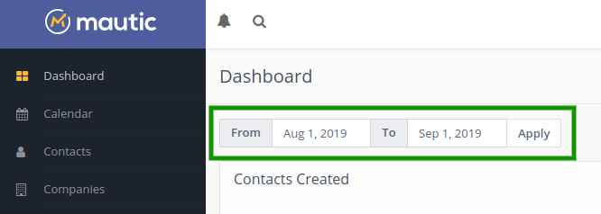

Mautic 1.4.0 introduced a customizable dashboard where each user can compose widgets with information they want to track.  Mautic 2.0 brought a number of enhancements to the Dashboard.

## Date range filter

All the widgets will display data in the selected global date range filter at the top of the widget list. The default date range is set from 30 days ago to today. 

Line charts will change the time unit automatically depending on the day count selected in the date range filter like this:

Date range is equal 1 day: data will be displayed in hours
Date range is between 1 and 31 days: data will be displayed in days
Date range is between 32 and 100 days: data will be displayed in weeks
Date range is between 101 and 1000 days: data will be displayed in months
Date range is greater than 1001 days: data will be displayed in years
 
The only widget exceptions which display the same information independent on the date range are *Upcoming emails* and *Recent activity*.

## Widgets

> Warning: Do not create too many widgets. It can slow the dashboard page load down. If you have performance issues, decrease the amount of widgets.

A new widget can be added to your dashboard when you click on the "Add widget" button. The "Add widget" form which appears after each widget will let you define:

- **Name**: Describe what the widget displays. If not filled, Mautic will call it the same as the widget type you select.
- **Type**: Select what information you want to display from the predefined widget types.
- **Width**: Select how wide the widget should be. The options are 25%, 50%, 75%, 100%. The default option is 100%. The optimal width for line charts is 100%, for tables 50%, for pie charts 25%.
- **Height**: Each widget can have different height. 5 heights are predefined. The dashboard will look best if you select a consistent height for each widget in the same row.

Some widgets have additional options:

**Created contacts over time**
- Show all contacts: Displays one line with all created contacts.
- Only identified: Displays one line with only created and identified contacts.
- Only anonymous: Displays one line with only anonymous visitors.
- All identified vs anonymous: displays 2 lines with anonymous visitors and known contacts.
- Top segments: Displays up to 6 lines representing the number of contacts added to the top 6 segments. If no such segment exists for the selected date range, the chart will not be displayed.
- Top segments with Identified vs Anonymous: Displays up to 6 lines representing the top 3 segments for the selected date range. Each segment will show 2 lines with anonymous visitors and known contacts.

**Emails in time**
- Only sent emails: Displays 1 line with sent emails.
- Only opened emails: Displays 1 line with opened emails.
- Only failed emails: Displays 1 line with failed emails.
- Sent and opened emails: Displays 2 lines with sent and opened emails.
- Sent, opened and failed emails: Displays 3 lines with sent, opened and failed emails.

**Page visits in time**
- Total visits - Displays 1 line with all visits (page hits).
- Unique visits - Displays 1 line with unique visits (contacts).
- Total and unique visits - Displays 2 lines with unique and all visits.

### Widget ordering

Each widget can be moved on the dashboard using the drag and drop interface. Click and hold on the name of the widget to move it to another position.

## Dashboard export

Each dashboard, once configured, can be exported to a single file and shared with others. You can make a backup, send it to a colleague or share it online. It exports only the widget configuration - the data which it pulls is not included in the exported file.

## Dashboard import

If you export a dashboard, you can then upload it and import it again in the Dashboard Import page.

Mautic installation come pre-loaded with 3 pre-defined dashboards. The one called *default.json* is imported automatically, when your dashboard doesn't contain any widgets. The other 2 predefined dashboards are provided as an example. You can export and import any other dashboards and switch between them. Pre-defined dashboards can be:

Previewed - This will display the dashboard widgets for preview. The dashboard will be loaded using your existing Mautic data. Nothing is saved or changed.
Applied - This sets the dashboard as your primary dashboard. Warning: Your current widgets will be deleted by this action! Export the current dashboard if you want to go back to it later.
Deleted - This will delete the predefined dashboard.

## Widget cache

The WidgetDetailEvent automatically caches the widget detail data for a period of time defined in the configuration. The default cache expiration period is 10 minutes.

## Dashboard Permissions

If a Mautic user doesn't have the 'see others' or 'see own' permissions for a bundle, they won't be able to create widgets for that bundle. However, the widget can still be visible on their dashboard. For example if a user creates the widgets and then the admin removes the permission for that bundle, or if a user imports a dashboard which has widgets for bundles they are not permitted to access. In these cases, the widget is displayed on the dashboard, but with a message that the user doesn't have permission to see the data.

If a Mautic user has permission to see only their own data from a bundle, they will see only their own data in the Dashboard widgets. For example only contacts which they own, page hits of the pages they created and so on.
