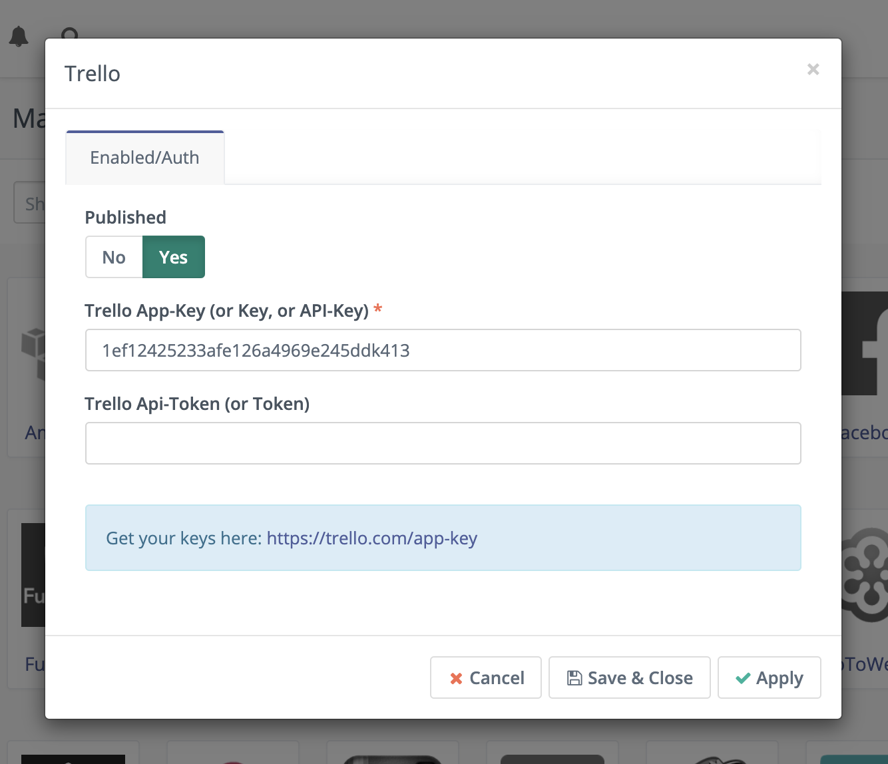
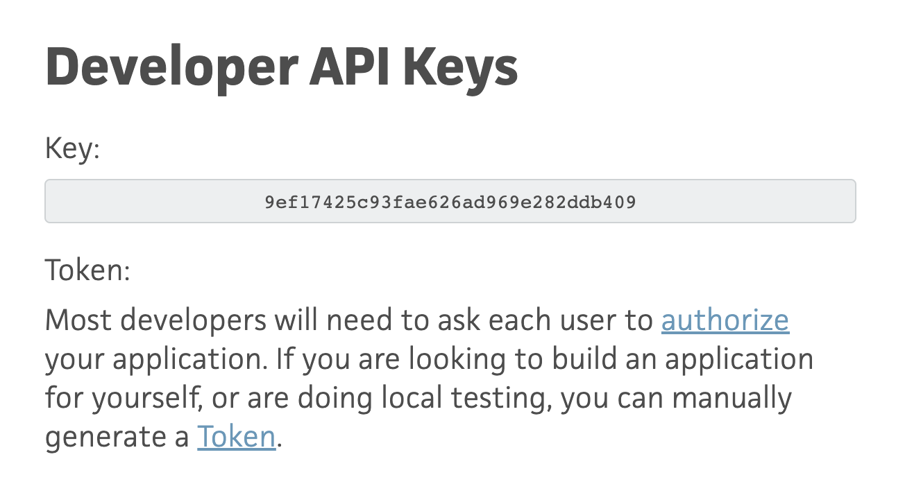
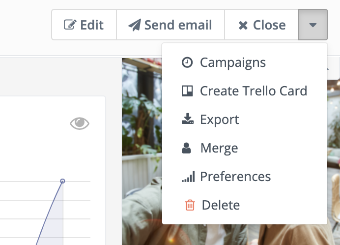
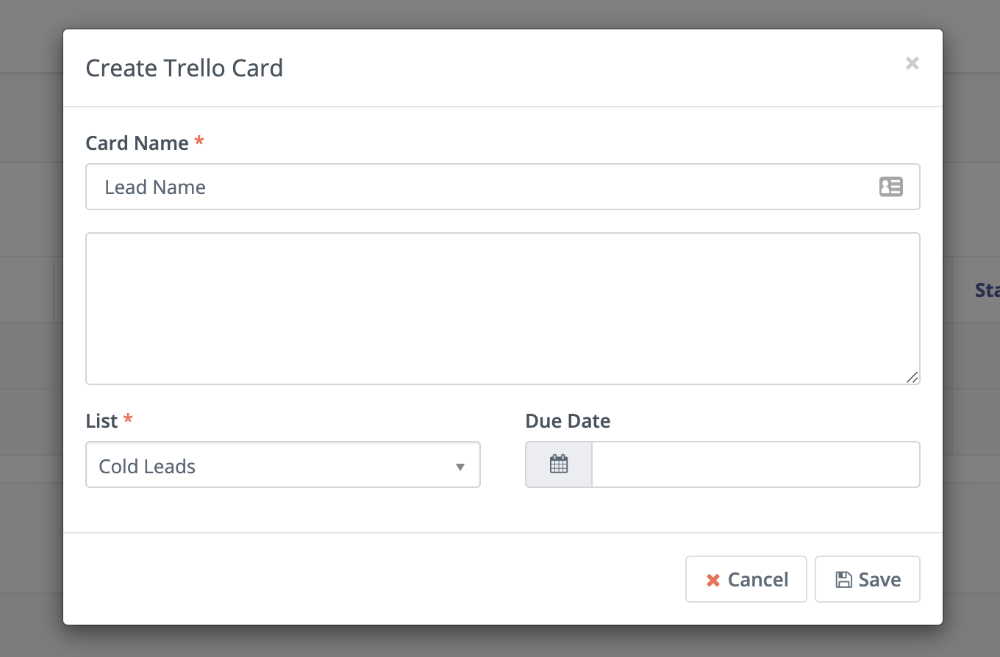

-------------------

## Mautic - Trello plugin

This plugin can create a Trello card based on a contact

### Requirements

- Mautic V3.0.2
- Trello

## Authorize the plugin

**Attention**:
You might want to use a separate Trello user for the authorization process. Everyone who has access to your Mautic will be able to see the names of all the boards and lists this user has access to (no the cards) and create cards in them.

1. Open Trello plugin settings (Settings > Plugins)\
   
2. Open [https://trello.com/app-key](https://trello.com/app-key) in a separate window.\
   
3. Copy the displayed key and add it to the plugin settings
4. Click "Generate a Token" on [https://trello.com/app-key](https://trello.com/app-key)
5. Follow the Trello authorization process
6. Copy the displayed token and add it to the Trello plugin settings

Don't forget to switch *Published* to *Yes* and save the configuration.

## Configure the plugin

Go to your settings and set your favourite board. Currently you can only use the plugin with one favourite board.

## Create Trello Card

1. Open the contact in the detail table. 
2. Click on the small arrow to display the advanced actions.

1. Click "Create Trello Card"
2. Enter all desired information and click "Save". 

**Note:**
Currently only lists from one board can be selected. The board can be changed via Settings > Configuration > Trello.