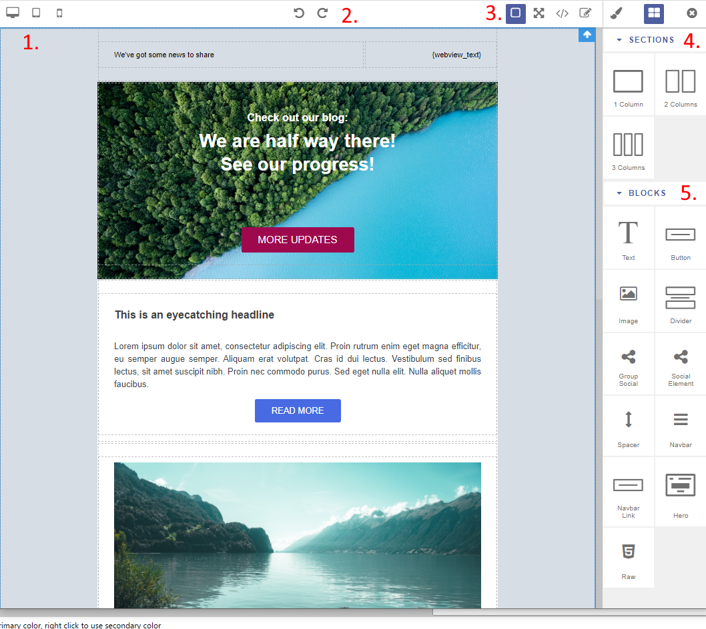

-----------

## Mautic - GrapesJs plugin

Since 3.2 [Mautic][mautic] users can choose between the legacy Email Editor and the new (beta) GrapesJs editor for email and landing page editing.

## Installation of the GrapesJS Editor

Follow the steps in the plugin's [Github page]: <https://github.com/mautic/plugin-grapesjs-builder>

## Email Editor Overview

The functions are as follows:

1. You can select different screen size to preview your emails.

2. You have the ability to undo and and redo your changes.

3. Editor functions from left to right: Display grids, Full screen view, export MJML / HTML code, Edit code, display customization options, display blocks, close editor.

4. Layout sections. These objects function as the barebone of your design. Create your email structure from sections, and pull in the different blocks you want to use.

5. Content blocks. You can populate your newsletter with these content blocks. Each block has specific layout, settings and design.

