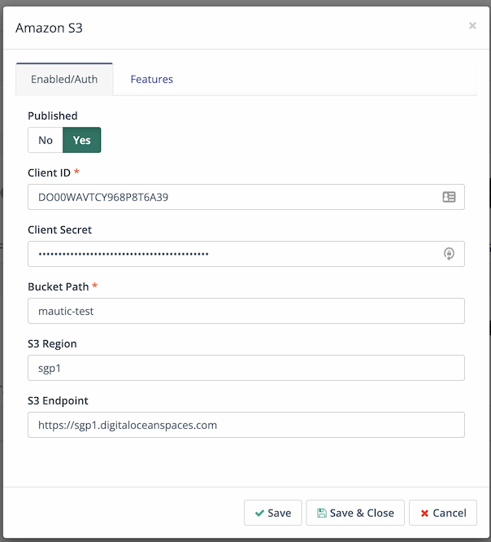

The Amazon S3 plugin allows you to host your [Assets][assets] on an Amazon S3 bucket instead of hosting them on your local server. When creating an asset you select from your S3 bucket, rather than your local computer.

## Setting up an S3 bucket

To get started, you need to sign up for an Amazon account.  Ensure you are familiar with the [pricing tiers for S3][s3-pricing-tiers] before you commit to using it.

Follow these steps to set up your Amazon S3 account if you are new to Amazon Web Services. This is an important step to ensure that you are not carrying out day-to-day tasks with your root account:

1. [Sign up for an AWS account][aws-signup]
1. [Set up an IAM user][create-iam-user]
1. [Sign in as IAM user][sign-in-iam-user]
1. [Set up your bucket][set-up-bucket]

> Note: The region you select for your bucket is important from a data protection perspective and you will need to copy this value to use when you set up Mautic. Consult your privacy policy and act accordingly.

Now you have created a bucket, we need to create a user which has the ability to access this bucket. We'll use the credentials for this user in Mautic - rather than your master account (which exposes you to significant risk if the credentials were ever exposed).

Select your account name in the top right corner, then select "My Security Credentials" from the drop-down list.  Choose Users > Add User and provide a name. Select 'programmatic access'.

Select Attach existing policies directly, filter for S3 by typing it in the search box, and select AmazonS3FullAccess, then click on the Next button.

Click next to proceed through, as we don't need to assign any tags.

The next screen will allow you to review the information submitted, and if you're happy with it, to create the user.

The next screen will allow you to view the Access Key ID and Secret Access Key.  

> Note: You must make a copy of these credentials as you will not be able to access them again. Download them and/or save them securely.

## Setting up S3 in Mautic

Now you have the bucket details, and a user with the appropriate credentials, it's time to set up Mautic to use this bucket for your asset storage.

Go to Settings > Plugins and if you don't see the Amazon S3 plugin, click on install/upgrade plugins.

Click on the S3 plugin and you will see a window with options which should be familiar from the earlier steps.

Enter the ID and secret from your user, and the bucket name. Also ensure you enter the bucket location as configured in Amazon S3.

Click on 'Apply' to save your changes, then click on 'Features' to ensure that the option to use a cloud providers for assets has been selected.

Click to save & close, and refresh the plugins page - the Amazon S3 plugin icon will be in color rather than greyscale, indicating that it is active.

Now, when you upload an asset to your S3 bucket you can select it by creating a new asset and choosing Remote Files > S3.

> Note, there is currently a [bug preventing this from showing files when using PHP 7.2+][s3-bug].

### Amazon S3 alternatives

The Amazon S3 plugin can be used with other S3-compliant storage services like [DigitalOcean Spaces](https://www.digitalocean.com/products/spaces), [Minio](https://min.io/), [Backblaze B2](https://www.backblaze.com/b2/cloud-storage.html), etc.

To configure storage other than Amazon S3, you need to enter the endpoint which can be found services website. The endpoint is usually in the format of `https://<region>.<provider>.com`.

[assets]: </components/assets>
[s3-pricing-tiers]: <http://aws.amazon.com/s3>
[aws-signup]: <https://docs.aws.amazon.com/AmazonS3/latest/gsg/SigningUpforS3.html#sign-up-for-aws-gsg>
[create-iam-user]: <https://docs.aws.amazon.com/AmazonS3/latest/gsg/SigningUpforS3.html#create-an-iam-user-gsg>
[sign-in-iam-user]: <https://docs.aws.amazon.com/AmazonS3/latest/gsg/SigningUpforS3.html#signing-in-iam-user-gsg>
[set-up-bucket]: <https://docs.aws.amazon.com/AmazonS3/latest/gsg/CreatingABucket.html>
[s3-bug]: <https://github.com/mautic/mautic/issues/8681>