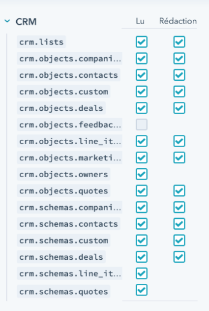

-------------------

## Mautic - Hubspot CRM plugin

[Mautic][mautic] can push contacts to [Hubspot CRM][Hubspot-crm] based on [Contact actions][testing] or [Point Triggers][points].

## Hubspot API key

1. Create a [Hubspot CRM][Hubspot-crm] account if you don't have one already.

2. Create a private app to [get credentials by following the Hubspot documentation][https://developers.hubspot.com/docs/api/private-apps]. You need to give to your private app the adapted rights for Mautic to handle contacts, companies, etc.

## Configure the Hubspot CRM plugin
>   *Note* Do not publish the plugin until all steps are completed

1. Open the Hubspot Plugin configuration

   - Paste the [API key][hubspot-keys] into the *Hubspot API key* input field.

1. Configure the _Feature Specific Settings_ to determine whether Contacts, Companies or both should be synchronised from Hubspot.

1. Save and close, then edit the plugin to configure the field mapping.

It is checked by default. If you uncheck it, the plugin will not push contacts to [Hubspot CRM][Hubspot-crm] any more.

1. Configure the [field mapping][field-mapping].

1. Save the plugin configuration.

   - If you want to use the plugin, set the *Publish* switch to *Yes*. Only do this when you have fully configured the plugin settings.

    

1. Set up the [cron job][cron-job] if you have not already configured it.

>>> Script to configure in your cron job: `php $PATH_TO_MAUTIC_DIRECTORY/bin/console mautic:integration:fetchleads --integration=Hubspot --fetch-all`

## Test the plugin

Follow [these steps][testing] to test the integration.

## Troubleshooting

If the contact has not been created, ensure the email address you tested with is valid. Hubspot will only create a new contact when the email address is valid.

Note, despite `--fetch-all` flag, the Hubspot API endpoints used in Mautic primarily leverage the following endpoints:

- `/companies/v2/companies/recent/modified/`
- `/contactslistseg/v1/lists/recently_updated/contacts/recent`

If you intend to do a full sync of your Hubspot contacts/leads, you will need to modify an attribute of each of them so that they appear in Hubspot's recent/modified endpoints. By default, these endpoints just pull contacts that have been modified in the last 30 days resulting in an incomplete sync if you are connecting to a long living Hubspot instance. [source][hubspot-endpoint-docs]

## Links

[mautic]: <https://mautic.org>
[Hubspot-crm]: <https://www.hubspot.com/crm>
[testing]: </plugins/plugin-resources/testing-integrations>
[points]: </points>
[hubspot-keys]: <https://app.hubspot.com/hapikey>
[field-mapping]: </plugins/plugin-resources/field-mapping>
[cron-job]: </setup/cron-jobs>
[hubspot-endpoint-docs]:<https://legacydocs.hubspot.com/docs/methods/companies/get_companies_modified>
