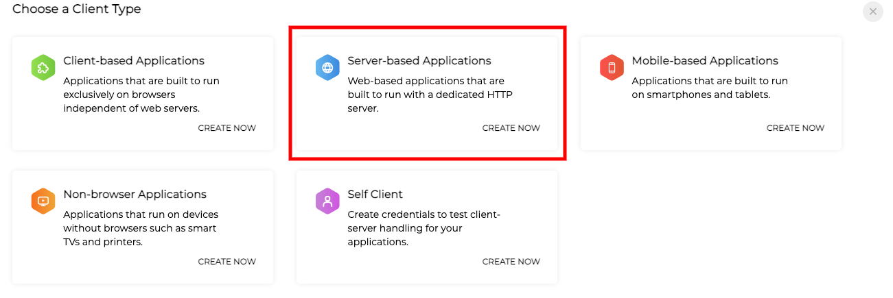

-----------

## Mautic - Zoho CRM plugin

[Mautic][mautic] can push a contact to [Zoho CRM][zoho-crm] based on [Campaign actions][campaigns] or [Point Triggers][points].

## Language configuration warning

>>>>Your [Zoho][zoho-crm] and [Mautic][mautic] accounts must be **configured with the English language**, otherwise the synchronization won't work. Zoho changes the alias of each of the contact fields depending on the language, which generates unmatched fields and errors on sync.

## Configure the Zoho CRM plugin

1. Create a [Zoho CRM][zoho-crm] account if you don't have one already.  

2. Generate a key pair by going to the [Zoho Developers Console][zoho-dev-console].  You will need to select **Server Based Applications** and provide a name for the client; the URL of your Mautic instance, and the callback URL (which you can access by going to Plugins > ZohoCRM in Mautic and copying the callback URL, usually in the format `https://mautic.example.com/plugins/integrations/authcallback/Zoho`).  Copy the Client ID and Client Secret that is displayed when you save the client - this will be needed in Mautic.

3. Insert the Client ID and Client Secret you created the Zoho Developers Console into the Mautic Zoho integration plugin, select the correct data centre based on the URL of your Zoho CRM instance, and click the button to authorize the plugin to access your instance.  You will see a popup window which prompts you to log into Zoho and to authorize access - select Accept.

>>>>> Note: You must select the correct data centre corresponding to your CRM instance - e.g. if you access your CRM at crm.zoho.com you should choose the .com option in the dropdown.

Once you have authorized successfully, the button will update to show 'Reauthorize'.

4. In the _Features_ tab you can select the behaviour that you wish to have happen with this integration:

* Triggered action push contacts to integration - **when triggered**, contacts are pushed from Mautic to Zoho
* Pull contacts and/or companies from integration - pull **all** contacts and/or companies from ZohoCRM into Mautic
* Push contacts and/or companies to this integration - push **all** contacts and/or companies from Mautic into ZohoCRM

Note this still requires a [cron job][cron-job] to function.

You can also configure other options:

* Update blank values:
 This will update blank values regardless of data priority, on both ZohoCRM and Mautic.
* Choose what Zoho Objects to pull data from:
 Here you can specify which objects you want to pull from ZohoCRM - Leads, Contacts and/or Accounts

5. Configure the [field mapping][field-mapping].  

>>> Note: If the values are empty for the Mautic object, a value of 'Unknown' will be sent. If the ZohoCRM field is a pick list, be sure the list values of Mautic's field match those of the field in ZohoCRM.

6. Set the *Publish* switch to *Yes*. 

7. Save the plugin configuration.

## Test the plugin

Follow [these steps][testing] to test the integration.

[campaigns]: </campaigns/campaign-events>
[zoho-crm]: <https://www.zoho.com/crm/>
[zoho-2fa]: <https://www.zoho.com/mail/help/adminconsole/two-factor-authentication.html#alink5>
[zoho-api-docs]: <https://www.zoho.com/crm/developer/docs/api/whats-new.html>
[zoho-dev-console]: <https://api-console.zoho.eu/>
[cron-job]: </setup/cron-jobs>
[mautic]: <https://mautic.org>
[field-mapping]: </plugins/plugin-resources/field-mapping>
[testing]: </plugins/plugin-resources/testing-integrations>
[points]: </points>
