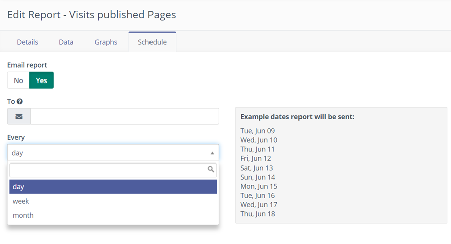

-----------

Highly customizable reports can be generated through Mautic's Report menu.

## Data Sources

Choose the data source appropriate to the report you want. Each data source has a different set of available columns, filters and graphs.


## Configuration

Each report can be customized to include the columns of choice. Filter data based on set criteria and/or set a specific order for the data.
In addition you can also group by and select different function operators to calculate fields. Note that when you select functions operators a totals row will be added to the report. This totals row will not be exported when selecting to export a report.


## Graphs

Some reports have graphs available. Select the graph desired from the left list - it will move to the right and will be part of the report.


## Dashboard Widget

Each graph of each report is made available as a widget on the dashboard allowing complete customization of the dashboard.


## Scheduling Reports

Enable or disable sending reports via email by using the toggle switch.

It is possible to schedule emails which will send reports to one or more email addresses. In the To field, enter a comma-separated list of email addresses and set the frequency of sending reports by choosing day, week, or month from the drop-down list.



Since version 3.2 it is possible to send a report once. This may be helpful if the report takes some time to load. The cron job will process the request, and send the result by email.

The problem is that email attachments cannot be too large, as this could prevent them being sent. If the file is greater than 5MB (configurable file attachment limit) then the CSV file will be zipped. If the zip package is within the file attachment limit then it will be sent as an email attachment. If it is still too big the zip file will be moved to a more permanent location, and the email will contain a link to download it. The download link works only for logged in Mautic users.

If someone tries to download a compressed CSV report that had been deleted for whatever reason, Mautic will schedule the report to NOW again, and send the user the email notification when the CSV report has been created.

The one-time report export and send can be configured 2 ways:

1. By scheduling the email:


2. By a button from the report list:


The button is available only for non-scheduled reports as it would reset configuration for scheduled reports.

### Cron job to schedule reports

To be able to send scheduled reports, the following cron command is required:

```
php /path/to/mautic/bin/console mautic:reports:scheduler [--report=ID]
```
The `--report=ID` argument allows you to specify a report by ID if required. For more information, see [Cron jobs][cron-jobs].

[cron-jobs]: </setup/cron-jobs#send-scheduled-reports>
