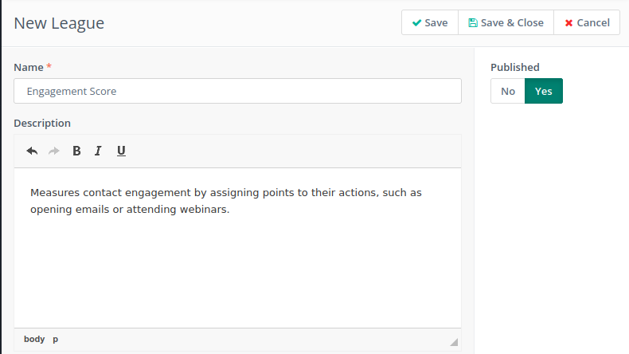
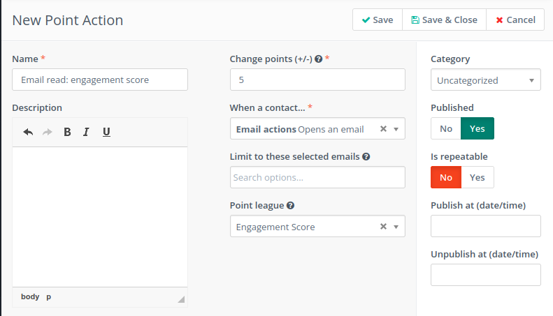
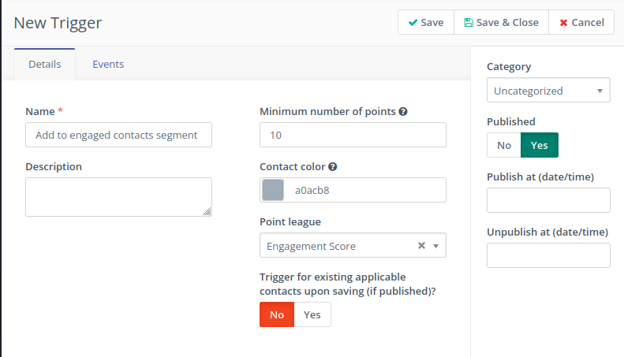
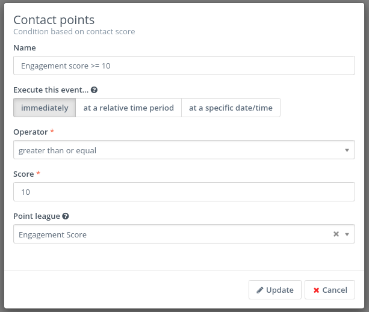
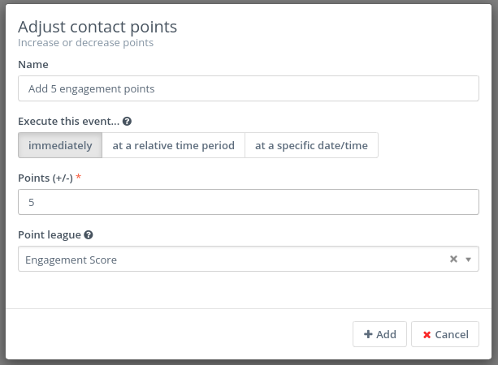
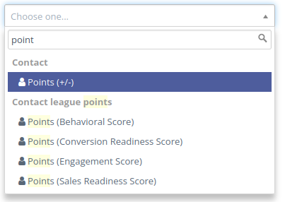
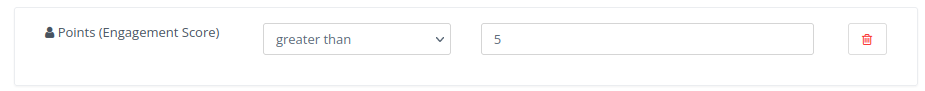
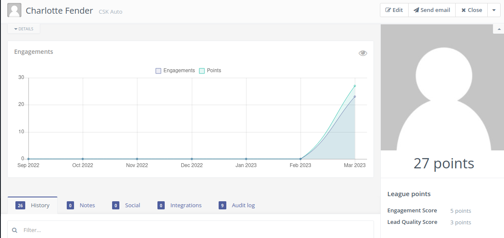
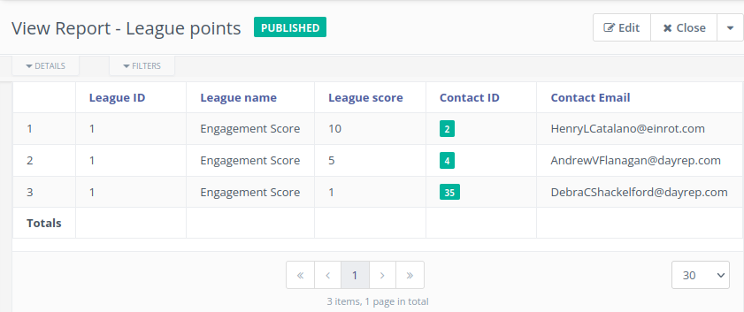

---
title: 'Point leagues'
media_order: ''
body_classes: ''
order_by: ''
order_manual: ''
slug: points-leagues
taxonomy:
    category:
        - docs
----------------------------
Point Leagues is a feature that allows users to categorize the score of their contacts. By setting up point leagues, users can assign a specific number of points to each action taken by a contact, such as opening an email, visiting a landing page, or downloading a resource.

## Managing point leagues
To access the currently defined point leagues in Mautic, navigate to the Points Menu and click on the "Manage Leagues" link. To create a new league, simply click the "New" button. 

Provide a name and description for the league and click the "Save & Close" button to create the league.

## Point leagues usage

### Point actions
You can change a contact's points within a Points League by using Points Actions.

### Point triggers
You can utilize point triggers based on point leagues to automatically trigger specific events within the system.

### Campaign condition
You can use a condition based on league contact score in a campaign.

### Campaign action
You can use a campaign action to increase or decrease the league contact score.

### Segment filters
Each point league adds a new filter that you can use in the segment configuration.

## Contact details
Point leagues can be viewed in the contact details page.

## League report
You can generate a report containing information about contact point leagues. 
