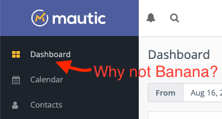
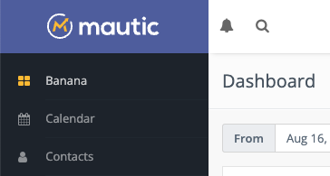

---------------

Being an international project with a world-wide community, many translations for Mautic exist. If you can't find your language yet, take a look to the section about how to [translate Mautic][translating-mautic].

*If you are looking to translate emails, dynamic content or landing pages, this page is not for you. You can translate all content and it will be used according to the contacts "Preferred Locale" field or the browser settings. For more information, consult the respective pages for [mails][emails], [dynamic content][dynamic-content] and [landing pages][landing-pages].*

## How to select a language in Mautic

There are two places to select the language for the User Interface.

### Default language

The default language configuration happens first in the Mautic configuration. The default language is `English - United States`. Every User has this language if they don't set something different in their profile.

1. Open the configuration menu by clicking on the cog icon in the top right corner.
2. Select the *Configuration* menu item.
3. Select the default language.
4. Save the configuration.

.. vale off
### 2 User language

.. vale on

A User can define their preferred language and override the default language. This allows a multilingual team work on the same Mautic instance.

1. Open the User Account menu by clicking on the User's name in the top right corner.
2. Click on *Account* menu item.
3. Select the User language.
4. Save the User profile.

## How to translate Mautic

It's possible to translate Mautic into any language. As Mautic is a community project, any community member can suggest and translate Mautic into any language. Mautic uses [Transifex][transifex] to crowd source translations.

1. Create an account at [Transifex][transifex] if you don't have one already.
2. Take a look at the [list of languages][transifex] already existing.
3. Create a language if your language is missing, or apply for an existing language.

Take a look at official [Transifex Documentation][transifex-documentation] if you have any questions about the translation process.

## How to update a language

Mautic downloads language updates automatically when saving Mautic's Configuration, if language isn't already downloaded. To force an update of a language:

1. Open the Mautic file system via SFTP or SSH.
2. In the Mautic root folder you should see the folder called *translations*. Open it.
3. In the *translations* folder are the languages available in Mautic. Remove the folder of the language you want to update.
4. Go to the Mautic Configuration and save it with the language you've deleted selected.

Mautic downloads the language again, with the latest translations. There is a daily process which generates the language packs from Transifex.

If you have any questions about translations, join the community in the [Slack #Translations channel][slack-channel].

## Translation overrides

Mautic allows you to override the existing language translations without the need to hack the core files. That's a good idea, especially because a Mautic upgrade would remove your modifications. Here's how to change translations correctly:

As an example, to override the first menu item "Dashboard" and change it to "Banana" follow these steps:

### 1 Search for the translation key

The best way to search for the right translation key is in a text editor like VS Code that allows you to search for a text in all files of Mautic's source code and filter those files by file extension `*.ini`. 

GitHub has also an option to search for strings in the repository - it's not particularly good search engine but for this example it works well enough.

Try searching for 'Dashboard menu' within the Mautic/Mautic repository, as there is special translation for the menu item and another for the page title. GitHub won't find the right translation when you search for just 'Dashboard' - it requires the full string. Next, use the filter to show only INI files. Here is the link to the search result:

[https://github.com/mautic/mautic/search?l=INI&q=Dashboard+menu][github-search]

The first file found is `app/bundles/DashboardBundle/Translations/en_US/messages.ini` and there is the line `mautic.dashboard.menu.index="Dashboard"` within the file, which is text to override.

.. vale off
### 2 Override the translation

.. vale on

The string to override is `mautic.dashboard.menu.index`. 

To create the override:

1. Go to the folder `translations` in the root directory of the Mautic project
2. Create new folder in it called `overrides`
3. In this folder, create the folder for the locale to override. In this example, the default locale is in use - `en_US` - but if you use different language then you'll see its locale as a folder in the `translations` folder - create a folder within the overrides folder using the exact name of the locale.
4. In the `translations/overrides/en_US` folder - replace en_US with the locale you are overriding - create new file called `messages.ini`. Notice it's the same filename as the original. It must be exactly the same. Some translations may be in `flashes.ini` or `validators.ini` and if you override a translation from those files then you have to create the correct file too, and add the translation strings to be overridden in the file. 

In this file, copy the line to override from the original `app/bundles/DashboardBundle/Translations/en_US/messages.ini` file and change the translation like so:

`mautic.dashboard.menu.index="Banana"`

Save the file and clear the cache with `bin/console cache:clear` command. Refresh your Mautic instance, and the administration is finally perfect:

[emails]: </channels/emails/managing-emails>
[dynamic-content]: </components/dynamic-web-content>
[landing-pages]: </components/landing-pages/managing-pages>
[transifex]: <https://www.transifex.com/mautic/mautic/>
[transifex-documentation]: <http://docs.transifex.com/tutorials/txeditor/>
[slack-channel]: <https://mautic.slack.com/archives/C02HV79J2>
[translating-mautic]: <https://docs.mautic.org/en/translations#how-to-translate-mautic>
[github-search]: <https://github.com/mautic/mautic/search?l=INI&q=Dashboard+menu>

