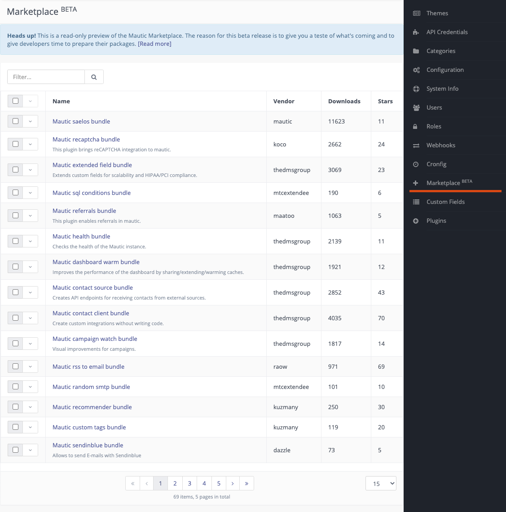
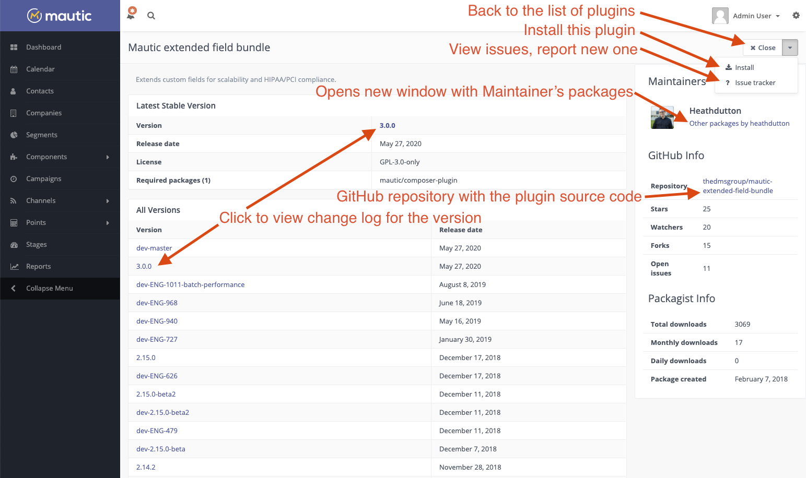

---

*Mautic 4 comes with new Marketplace. In the initial release there is just plugin browser. The features to install and update plugins will be added in a future feature releases, as it depends on the new Composer v2 support and new file structure.*

**Warning**

*The first Marketplace version does not check for Mautic version compatibility yet, as this requires a change in each existing plugin.

Please do not blindly manually install plugins you see there as they may not work with your version of Mautic. Always check if they support your Mautic version before installing.  Developers can refer to the [Developer Documentation][dev-docs] for how to make your plugin compatible with the Mautic Marketplace.*

### List of plugins

The list of Plugins is accessible from your Mautic administration menu. Click the cog icon in the top right hand corner to display the menu.

The list view allows you to search for specific keywords. It displays quick stats of how many times a Plugin was downloaded and how many stars it has in [Packagist][packagist]. It also shows the vendor who has developed the plugin. Sadly, the sorting by columns is not available at the moment because it's not supported by the Packagist API. We hope to add this in a future release.

Click a Plugin name to view details.



### Plugin detail page

The detail page gives you enough information together with links to additional resources to decide whether you want to install the Plugin or not.

#### Latest stable version

The first information you see is the latest stable version. *In the future you will also see what version is currently installed (if any), and this will allow you to upgrade.*

All Plugins should follow [semantic versioning][semver] so you can see from the first glance whether it is a breaking change version, feature version or bug fix (patch) version. In short, it is more risky to install breaking change versions and less risky to install a bug fix version.

The license should be GPL v3 mostly as Mautic is released under GPL v3 which is a viral license. This means anything using Mautic's code base should also be released under the same license.

Required packages are dependencies. The bigger is the list of dependencies, the bigger will be the size of the Plugin. More dependencies also means more security risks and incompatibility issues with future upgrades.

#### All Versions

The next table shows the list of all versions. *In the future versions of the Marketplace it should be possible to select which version you want to install or upgrade to.*

From the list you can see how many times the Plugin has been released and the release cadence. When you click on a specific version, it will open a new window where the Plugin maintainers should provide a changelog. This will tell you what has been added or which bugs were fixed in the specific version.

#### Maintainers

In this section is a list of maintainers of the Plugin on Packagist. There may be more contributors in the GitHub repository. There is also a link to the maintainer's Packagist detail page where you can browse other PHP packages by the same maintainer.

#### GitHub information

[GitHub][github] is a social network for developers. The majority of Mautic Plugins are available on GitHub. There are some stats available directly in this section, but you can find much more if you follow the link to the repository.

#### Packagist information

[Packagist][packagist] is a PHP package repository. It is not related specifically to the Mautic Community, but to the PHP community. 

All the PHP packages listed in Packagist are installable by [Composer][composer] which is a tool for dependency management used under the hood when you install a Mautic Plugin. The Packagist section shows download stats of how many times the Plugin has been installed in different timeframes.

#### Context menu

The context menu shows actions you can take.
- Close will take you to the List View
- Install will install the Plugin
- Issue tracker will open a new window with the issue tracker for the Plugin. It will show only if the Plugin has this information available. Use this option to search for issues with the Plugin and to report new issues to the maintainers.



### CLI command

The Marketplace has commands that can be used by those who prefer using the command line to the user interface, or for some automations.

#### List Plugins

`bin/console mautic:marketplace:list` will list first page of available Plugins like so:

```
+-------------------------------------------------------+-----------+--------+
| name                                                  | downloads | favers |
+-------------------------------------------------------+-----------+--------+
| mautic/mautic-saelos-bundle                           | 11623     | 11     |
| koco/mautic-recaptcha-bundle                          | 2662      | 24     |
|     This plugin brings reCAPTCHA integration to       |           |        |
|     mautic.                                           |           |        |
| thedmsgroup/mautic-extended-field-bundle              | 3069      | 25     |
|     Extends custom fields for scalability and         |           |        |
|     HIPAA/PCI compliance.                             |           |        |
| mtcextendee/mautic-sql-conditions-bundle              | 190       | 6      |
| maatoo/mautic-referrals-bundle                        | 1063      | 5      |
|     This plugin enables referrals in mautic.          |           |        |
| thedmsgroup/mautic-health-bundle                      | 2139      | 11     |
|     Checks the health of the Mautic instance.         |           |        |
| thedmsgroup/mautic-dashboard-warm-bundle              | 1921      | 12     |
|     Improves the performance of the dashboard by      |           |        |
|     sharing/extending/warming caches.                 |           |        |
| thedmsgroup/mautic-contact-source-bundle              | 2852      | 43     |
|     Creates API endpoints for receiving contacts from |           |        |
|     external sources.                                 |           |        |
| thedmsgroup/mautic-contact-client-bundle              | 4035      | 70     |
|     Create custom integrations without writing code.  |           |        |
| thedmsgroup/mautic-campaign-watch-bundle              | 1817      | 14     |
|     Visual improvements for campaigns.                |           |        |
| raow/mautic-rss-to-email-bundle                       | 971       | 69     |
| mtcextendee/mautic-random-smtp-bundle                 | 101       | 10     |
| kuzmany/mautic-recommender-bundle                     | 250       | 30     |
| kuzmany/mautic-custom-tags-bundle                     | 119       | 20     |
| dazzle/mautic-sendinblue-bundle                       | 73        | 5      |
|     Allows to send E-mails with Sendinblue            |           |        |
+-------------------------------------------------------+-----------+--------+
Total packages: 69
Execution time: 388 ms
```

There are options that will allow you to filter or go to next pages. The full list will show up when you add `--help` after the command, as used in other Mautic commands.

```
  -p, --page[=PAGE]      Page number [default: 1]
  -l, --limit[=LIMIT]    Packages per page [default: 15]
  -f, --filter[=FILTER]  Filter the packages [default: ""]
  -h, --help             Display this help message
```

Example usage how to search for Captcha Plugin: `bin/console mautic:marketplace:list --filter=captcha`

### Planned features

The Marketplace is lacking some important features. In the text above there are mentions of several planned features. Most of the features are waiting for the Mautic 4 release and its main features (Composer v2 support, new directory structure) and therefore can be developed when all these features come together.

- Mautic version compatibility check. The Marketplace should tell you whether a Plugin is compatible with your Mautic installation,
- Installation via CLI and UI,
- Update of installed Plugins,
- Automatic Plugin updates - there will be configuration that will allow you to set globally whether you want to automatically upgrade Plugins and also have the possibility of configuring this at the plugin level. Automatic upgrades make sense only for bug fix releases. Other releases are too risky and should be handled manually. [API reference][track-updates]
- List security advisories. [API reference](https://packagist.org/apidoc#list-security-advisories)
- Notifications about new versions and security vulnerabilities that have been identified,
- Support also theme installations and updates.
